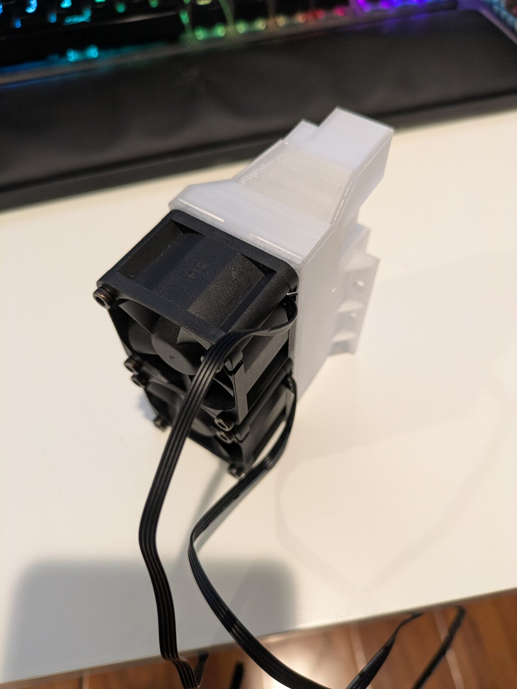
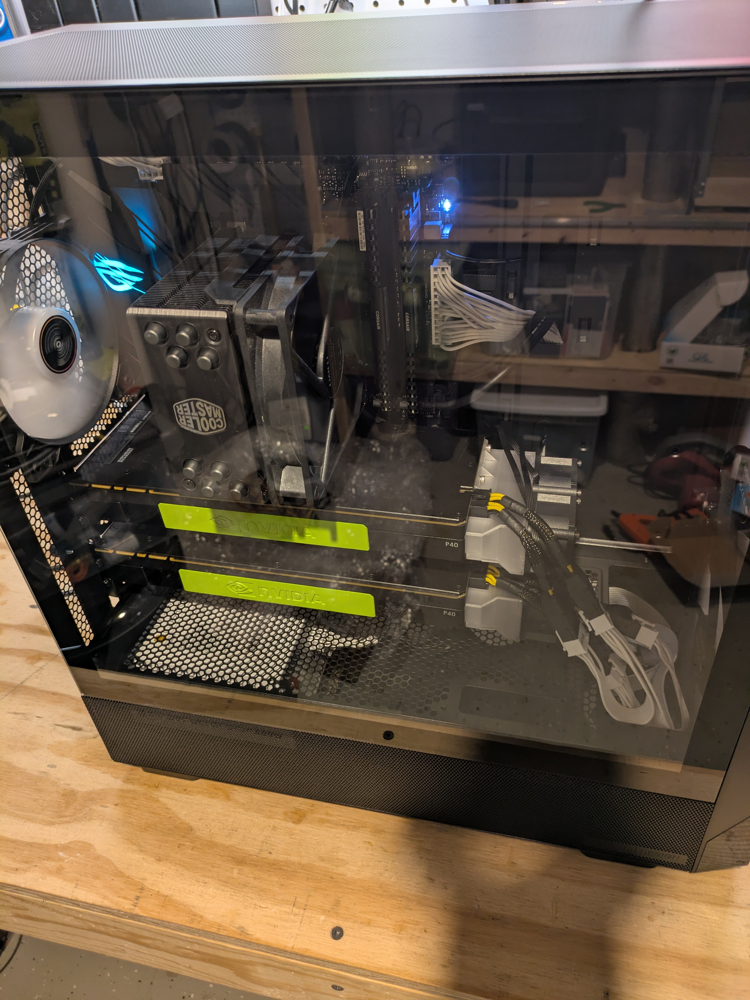

This is Part 2 in my series about building a cheap VRAM AI machine with used Tesla P40 GPUs. If you haven't already, check out [Part 1: When Cheap VRAM Gets Complicated](/posts/tesla-p40-ai-server-project/) for the backstory on why I needed P40s, and optionally, [the troubleshooting post](/posts/troubleshooting-tesla-p40-dell-precision-t7820/) for the technical details of the dead end that led to this build.

In the first post, I explained why I went chasing cheap VRAM in the first place. The short version: local LLMs love VRAM, modern high-VRAM GPUs are painfully expensive, and used Tesla P40s offer 24GB of CUDA-compatible VRAM for a price that justifies using 10-year-old datacenter hardware for this project.

The original plan was to put two P40s into a Dell Precision T7820 workstation. On paper, that made a lot of sense. The T7820 had a big chassis, a 950W power supply, documented support for high-power GPUs, and a tiny Radeon WX3100 display card already installed. It looked like exactly the sort of serious workstation that should make an old datacenter GPU project easier.

It did not, and you can read all about it in that post.

At some point I had to stop asking, “Can I make this workstation work?” and start asking a more useful question:

“What is the fastest path to a working inference box?”

The answer turned out to be much less enterprise-y than I expected - I built the next version around commodity AM4 desktop hardware.

## The Backwards-Sounding Plan

After fighting with the T7820 for a weekend, I was ready for something boring.

A standard ATX power supply. A standard consumer motherboard. A normal BIOS. Normal fan headers. Normal cabling. Normal documentation. A platform where I could reason about what was happening without constantly wondering how much Dell-specific magic was in the way.

That led me back to AM4.

This felt a little backwards. Running old passive datacenter GPUs in a consumer desktop platform sounds risky. But in practice, the consumer platform gave me more control.

### Why AM4?

AM4 made sense for a few reasons.

First, it was cheap. AM4 is no longer AMD's newest platform, so used last-gen parts are widely available at more affordable prices.

Second, it was still good enough. A local AI server doesn't need the latest CPU or RAM or storage - it's all about the GPUs. And while AM4 wasn't designed to run datacenter-class GPUs, it *WAS* designed to run modern high-end gaming GPUs. I was hopeful that it would be better equipped to handle the P40 than the T7820 turned out to be.

Third was a personal reason: I already had some familiarity with the platform from other machines at home, and that also meant I had a few spare parts laying around to keep costs down a bit.

The goal was not to build the most elegant AI server possible, the goal was to get the P40s working.

## The Motherboard: ASUS ROG Strix B550-E Gaming

The motherboard choice mattered more than the CPU choice. Ideally, I wanted a motherboard that offered two full-length PCIe slots with decent bandwidth to host the P40s. This is where AM4 boards vary dramatically, so I had to be a bit careful in my choice here.

For AI inference, PCIe bandwidth is also not the same kind of issue it would be for gaming. Once the model is loaded into VRAM, token generation is usually much more sensitive to GPU compute and memory bandwidth than to PCIe bandwidth. But PCIe still matters for model loading, startup, offload behavior, and multi-GPU communication, so I wanted a decent setup here.

The two most modern AM4 chipsets are the B550 and the more powerful X570. Used B550 boards are significantly cheaper than X570 boards, but also have a much wider range of PCIe slot configurations. Many B550 boards with a second full-length physical slot have it at x4 and wired through the chipset at low bandwidth as opposed to a direct connection to the CPU. I didn't want that, I wanted a board where the two main PCIe slots could split the CPU’s 16 GPU lanes as x8/x8 when both slots were populated. Both cards talking direct to the CPU, no routing through the chipset.

This is fairly common on mid-to-high-end X570 boards but very rare on B550 boards. In fact, only mainstream B550 board I found with this feature was the ASUS ROG Strix B550-E Gaming.

I found a used one on eBay for $150.

One thing worth noting here is to pay attention to how your board allocates PCIe lanes. Many boards share lanes between secondary PCIe slots, M.2 slots and/or SATA ports. You often can't have them all populated at the same time without something getting downgraded or turned off. On my B550-E for example, if I populate the second M.2 slot, the fifth and sixth SATA slots are disabled, but there are definitely boards that share lanes between M.2 and the second GPU slot, so just be aware.

## The CPU: Ryzen 5 5600X

For the CPU, I went with a Ryzen 5 5600X.

I just needed a decent AM4 processor with a few cores and the 5600X fit the bill. It is a six-core Zen 3 chip with enough performance to be a perfectly competent Linux server CPU.

A Ryzen 5 5600 or 5700X would also have been equally reasonable. I found a new 5600X tray CPU on eBay for $140.

## Power: Normal ATX Is a Relief

One of the best parts of leaving the Dell workstation behind was getting back to normal ATX power.

The P40 is not powered like a normal consumer GPU. It uses an EPS-style 8-pin connector, not a standard PCIe GPU power connector. That distinction matters a lot, because the +12v lines and the ground lines are on opposite sides of the connector from what you'd see for PCIe. So, make sure you get a proper adapter and don't try to just build your own. For the P40, I used adapters that convert:

```text
2x PCIe 8-pin -> 1x EPS 8-pin
```

That means each P40 expects two PCIe GPU power leads from the PSU to feed one EPS connector on the card.

With the Dell, this became annoying because the PSU did not expose normal modular ATX cables. Power was distributed through Dell's proprietary motherboard and power distribution setup. That meant special cables, extra uncertainty, and more ways to be wrong.

With the AM4 build, the power path was much easier to reason about: PSU → normal PCIe GPU power cables → known adapter → P40. Still weird compared to a gaming GPU, but fairly straightforward.

With 2x 250W GPUs in the system I would need a pretty decent PSU. I picked up a Thermaltake 850W modular PSU at Microcenter for the project, as I didn't have anything appropriate in my spare parts pile. 850W should give me plenty of headroom, since outside of the GPUs this system will just have a modest processor, a single M.2, and some RAM.

## RAM

Here's where I cheated a bit and pulled from my parts pile. My gaming rig is also AM4 and it had 64GB of DDR4-3200. It doesn't need 64GB, so I pulled 32GB of that for use in this system.

## Cooling: The P40 Still Thinks It Lives in a Server

Changing the platform did not change the basic cooling problem. The Tesla P40 is passively cooled. It was designed for rackmount servers with high-pressure front-to-back airflow. In that environment, the server fans do the work. In a normal case, you need to force a lot of air through the GPU heatsink.

Fortunately, I have a 3D printer, so I printed shrouds designed to attach two high-speed 40mm fans to the rear of a P40.



The fan setup was not elegant, but it did the job:

* 3D-printed shroud on the P40
* Two high-speed 40mm fans per card
* PWM fan hub to run the 4 GPU fans


The early temperature results were encouraging. At full blast, the fans are fairly loud but effective. At idle, the P40 sat around 18-20°C. Under load, I saw temperatures in the mid-20s to low-30s°C range during initial testing, with the card pulling up to around 191W. I then dialed back the fans to see how low I could go and keep the cards decently cool. I'm now running the fans at about 40% which keeps temps in the 40s when under inference load while being far quieter. I do have a monitoring script that will ramp the fans up if necessary.

## The Case

The case was intentionally the last thing I bought because I not only wanted to validate that this system would work, but I also wanted to make sure I knew exactly how much space I would need.

"Nothing fancy" is again the theme here, just something roomy with good unobstructed airflow. I picked up a Montech mid-tower at Microcenter for $90 that was perfect for the job.

## The Parts List

The successful build was completed with this hardware:

* ASUS ROG Strix B550-E Gaming motherboard - $150
* AMD Ryzen 5 5600X - $140
* 32GB DDR4 - Free/reused
* Samsung 980 Pro 500GB NVMe SSD - Free/reused
* 850W ATX power supply - $90
* 2x NVIDIA Tesla P40 24GB - $500
* 3D-printed P40 cooling shroud - Free
* High-speed 40mm fans - $25 for 5-pack
* SATA-powered PWM fan hub - $12
* Cables - $30
* Temporary Bootstrapping GPU - Used the WX3100 out of the T7820 - Free

All-in cost was around $950, similar to my T7820 attempt and still under $1,000.

## BIOS Setup

Compared to the Dell, the ASUS BIOS was refreshingly boring.

The most important setting was:

```text
Above 4G Decoding: Enabled
```

This matters because large PCIe devices need address space for their resources. The P40 has large BAR requirements, and while enabling Above 4G does not guarantee success, it is absolutely one of the first settings to check when working with large GPUs.

I also kept the setup as simple as possible during initial testing:

* One P40 installed
* No unnecessary expansion cards
* Secure Boot disabled

After the T7820 experience, I was not trying to be clever. I wanted the most boring path to a healthy `nvidia-smi`.

## Ubuntu and NVIDIA Driver

For the OS, I used Ubuntu Server 24.04.

I had tried multiple Ubuntu versions during the Dell troubleshooting, including newer releases, but for the successful build I wanted a stable server base and a known-good NVIDIA stack.

The 580 series driver which NVIDIA announced as the last to support Pascal-era cards worked well:

```bash
sudo apt install nvidia-driver-580
```

After installation and reboot, the basic test was simple:

```bash
nvidia-smi
```

This time, instead of another failure, I got the thing I had been trying to get all along: a healthy Tesla P40 visible to the NVIDIA driver.

The card was no longer just a PCIe device that Linux could identify. It was a usable CUDA GPU.

## The Satisfying Part: `nvidia-smi`

After all the T7820 weirdness, seeing `nvidia-smi` work felt absurdly good.

The output showed:

* Tesla P40
* 24,576 MiB VRAM
* NVIDIA driver 580.159.03
* Low idle power around 9-10W
* Idle temperature around 18-20°C
* Normal-looking clocks and power state

At this point, the AM4 system had already cleared the hurdle that the Dell never did. The P40 was initialized, manageable, and visible as a CUDA device.

I also enabled persistence mode:

```bash
sudo nvidia-smi -pm 1
```

## Checking CUDA Visibility

The next test was whether my inference software could actually see the card.

Using a CUDA-enabled build of llama.cpp, I checked the available devices:

```bash
./build/bin/llama-cli --list-devices
```

The important result was that llama.cpp saw the P40 as a CUDA device:

```text
CUDA0: Tesla P40
```

That was the second big checkpoint.

`nvidia-smi` proved the NVIDIA driver could manage the card.

llama.cpp seeing CUDA0 proved the inference stack could use it.

Now I could finally stop debugging the platform and start testing the actual workload.

### One quirk: PCIe Link Speed

One thing I noticed was that the P40's negotiated PCIe link was not what the card was capable of.

The card reported a capability of PCIe 3.0 x16:

```text
LnkCap: 8GT/s x16
```

But the actual link status showed:

```text
LnkSta: 2.5GT/s x8
```
That means the card was capable of more, but was currently running at PCIe 1.0 speed and x8 width.

Not to worry: this was just the card spinning down when idle. I later verified that when under load, the card ran at PCIe 3.0 speeds and x16 width.

## First llama.cpp Runs

For early testing, I wanted to do some apples-to-apples comparisons to my 5060 Ti setup so that I could level-set my expectations. The model I used was Qwen3.6-35B-A3B in GGUF form, using Unsloth's UD-IQ3_S quantization, not because this was the best choice for a P40 or dual-P40 system but because it's what I'm using on my 5060 Ti for agentic coding.

The llama.cpp command line got fairly involved to match my 5060 Ti setup as closely as possible, but the rough shape was:

```bash
./build/bin/llama-server \
  -m /path/to/Qwen3.6-35B-A3B-UD-IQ3_S.gguf \
  -c 262144 \
  -fa on \
  -ctk q4_0 \
  -ctv q4_0 \
  --ctx-checkpoints 64 \
  --kv-unified \
  --context-shift \
  --cache-reuse 512 \
  --perf \
  --no-warmup \
  --mlock \
  --slot-prompt-similarity 0.0 \
  -np 1 \
  -b 512 \
  -ub 256 \
  --no-mmap \
  -t 6 \
  -tb 6 \
  --threads-http 8 \
  --jinja \
  --host 0.0.0.0 \
  --port 11433
```

For this build post, understanding all of those flags isn't important, the important thing is simpler:

It ran.

The GPU loaded the model. CUDA was active. Power draw climbed. Utilization showed real work. The P40 was no longer a mysterious half-detected brick sitting on the PCIe bus, it was doing inference!

## Monitoring Under Load

Once the server was running, I watched the card with:

```bash
watch -n 1 nvidia-smi
```

Under load, I saw the P40 pull around 191W. GPU utilization climbed, memory was allocated, and temperatures stayed controlled.

On the system side, I also used sensor monitoring to keep an eye on the motherboard and CPU:

```bash
sensors
```

The early readings were reassuring:

* CPU max around the mid-60s°C
* VRM around the low-30s°C
* Chipset around the high-20s°C
* GPU temperatures comfortably low with the shroud/fan setup

This was another benefit of the consumer build: the system was understandable. I could see what was happening, reason about airflow, adjust fans, and move forward.

## Adding the second P40

At this point, I was confident I had a stable single-P40 setup and had SSH enabled for remote access, so it was time to add in the second card in place of my bootstrapping GPU.

Power got a little trickier here. With just one P40, I was using one PCIe connector from each of the two PCIe cables from my PSU. Each PCIe cable from the PSU had two PCIe connectors daisy-chained, but I didn't want to pull both PCIe plugs from the same cable, so I had used one from each of the two cables to connect to the EPS adapter. With two P40s in place, I ended up feeding each P40 using both daisy-chained PCIe connectors from a single cable. I could have also split both cards across both cables, but figured that would just make troubleshooting more difficult. I'll watch this closely but so far this has been completely stable. PCIe connectors are rated for 150W so presumably if the card pulls evenly from each source PCIe connection, it'll remain well within spec.

With the second P40 in place, everything pretty much just worked. `nvidia-smi` picked it up right away. I simply changed the `-t` flag on `llama-server` to `-t 1,1` to split the load across the two GPUs evenly, and that worked just fine. I saw model loading and inference load balanced between the two cards. This was the point where the build finally crossed from "I proved a P40 can work in this machine" to "I have the server I originally set out to build." After all the drama with the T7820, the second card showing up without a fight was almost suspiciously uneventful.

And with that, I have a working local dual-P40 AI inference server at my disposal!



## Early Performance Check

I'm not going to go too much into performance in this post, as the focus here was how to get a working build. However, it is important to temper your expectations and remember that you're working with 10-year-old hardware.

In general, using the same model and settings that I use for agentic coding on my 5060 Ti, the dual-P40 can process prompts at > 1000 tokens/second with fresh context, and it can generate tokens around 20 t/sec (vs. ~ 1,400 tokens/sec prompt processing and > 40 t/s generation on the 5060 Ti). This is not setting any speed records, but it is definitely usable!

This isn't actually a great test in terms of real-world scenarios. I didn't want the dual-P40 system because I thought it would outperform the 5060 Ti at the same tasks. The two reasons I wanted this system were:

1. To be able to run larger models than the 5060 Ti can comfortably run. The dual-P40 system can run 30B parameter dense models with plenty of VRAM left for context. That's simply not possible on a 16GB VRAM GPU like the 5060 Ti.
2. To be an always-on local AI inference server for me and my family. Now I don't have to worry about using my gaming rig when someone needs an AI model, and I have an always-there server to not only do interactive tasks but also background batch processing like I do when ingesting documents into my Paperless-NGX instance, where speed is not a factor.

In fact, although I tested my interactive agentic coding workflow on the dual-P40 just to give me some apples-to-apples numbers relative to my 5060 Ti, I will actually probably not use this dual-P40 system much for agentic coding, I'll use it for all of the other household AI applications that are less performance-sensitive.

## Commodity Consumer Grade > OEM Enterprise Grade

At the onset of this project, I would not have guessed that the consumer platform would be easier to work with than the workstation platform. The T7820 looked like the safe choice, but it came with a pile of OEM-specific assumptions:

* Proprietary power distribution
* Proprietary headers
* Proprietary BIOS behavior that was difficult to reason about
* PCIe resource allocation issues
* Display GPU weirdness
* Limited practical control

The AM4 system was less fancy, but it was much more transparent. Standard ATX power and motherboard headers, a normal consumer BIOS, and the ability to swap parts without wondering about proprietary Dell behavior all helped.

Sometimes the best platform for weird hardware is not the most enterprise platform, but the one that gives you the fewest additional mysteries.

## Conclusion

The AM4 build did what the Dell could not, it gave me a working Tesla P40 CUDA device in a system I could understand, power, cool, and troubleshoot.

Is it elegant? Not really. Is it faster than just buying a modern high-end GPU? Absolutely not.

But that was never the point. The point was to build a financially reasonable local inference server with a lot of VRAM, using weird old hardware that still had some life left in it. And we did it!

Now I'll turn my attention to what this system is really good at. Which models make the most use of that VRAM while still remaining reasonably performant? Which use cases are best suited for this sort of system? And I'm sure I'll be blogging about what I learn. Stay tuned!

