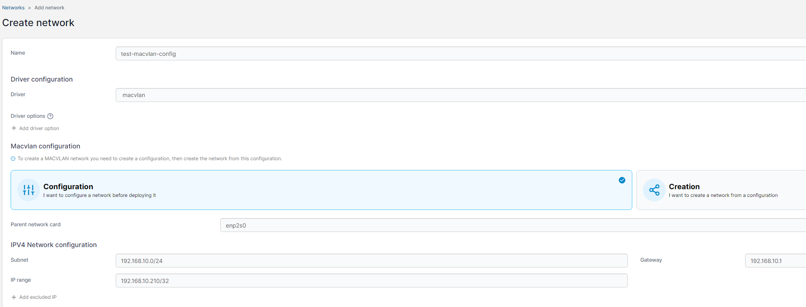
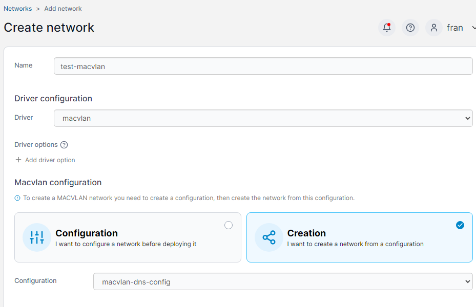

## Introduction

This post describes how I solved two separate but related problems with my Docker environment.

1. How to give a container an IP on the host's network
2. How to allow the host to talk to that container (once you do #1, you'll find that it can't by default)

This problem and solution are well-documented on the Internet, but I wanted to gather it in one place and go a little more in-depth in some areas.

## Isn't This an Anti-Pattern?

Generally speaking, yes - Docker containers are intended to be disposable and ephemeral and to abstract away many of the infrastructure details. The more you tie Docker containers to permanent things like IP addresses, the less flexible your environment becomes.

However, there are use cases where it makes sense to give a container an IP on the host network. For me, I wanted to run Technitium (a DNS server) as a container, but of course as a DNS server, it needs to have a static IP. Here's how I accomplished that.

## Using macvlan to Give a Docker Container an IP on the Host Network

The way you can accomplish this with Docker is by using the `macvlan` network driver. `macvlan` is a Linux virtual networking driver. It helps to first understand the concept of VLANs. A VLAN (virtual lan) is a networking concept that separates broadcast domains on a network by tagging the packets with a VLAN number. VLANs effectively allow you to create multiple virtual subnets without needing a separate physical network infrastructure for each subnet. To implement VLANs on a server, you effectively are creating two separate virtual network interfaces, each with their own Layer 3 (IP) address, on top of the same physical Layer 2 (Ethernet MAC) address - so both VLANs will have the same MAC address.

MACVLAN extends that model down into Layer 2. As the name suggests, it allows the user to create two virtual layer 2 interfaces, each with its own MAC address, on top of a physical network interface.

The reason we need MACVLAN and not VLAN in my use case is because I need both the container and the host to have an IP address on the same subnet.

## Creating the MACVLAN Interface

To accomplish this, we will create a new virtual interface on the host using macvlan, and then attach our container to it.

You first need to know the parent interface name. This is the network interface on the host that is attached to the network you are trying to use for your container.

Here's how I found it for my host:

```
$ ip addr
1: lo: <LOOPBACK,UP,LOWER_UP> mtu 65536 qdisc noqueue state UNKNOWN group default qlen 1000
    link/loopback 00:00:00:00:00:00 brd 00:00:00:00:00:00
    inet 127.0.0.1/8 scope host lo
       valid_lft forever preferred_lft forever
    inet6 ::1/128 scope host noprefixroute
       valid_lft forever preferred_lft forever
2: enp2s0: <BROADCAST,MULTICAST,UP,LOWER_UP> mtu 1500 qdisc pfifo_fast state UP group default qlen 1000
    link/ether e4:54:e8:75:59:2d brd ff:ff:ff:ff:ff:ff
    inet 192.168.10.50/24 brd 192.168.10.255 scope global enp2s0
       valid_lft forever preferred_lft forever
    inet6 fe80::e654:e8ff:fe75:592d/64 scope link
       valid_lft forever preferred_lft forever
```

You're looking for the name of the network interface which is bound to the subnet you're trying to set up for your macvlan, `enp2s0` in my case.

### Creating MACVLAN Networks in Portainer

I use Portainer to manage my Docker environment (yes, it's a crutch that I should get rid of, but that's for another day). To create a new MACVLAN interface with Portainer is, in a word, goofy.

The recipe is this:
1. Define a MACVLAN network in the Portainer interface. This is your "configuration". This is NOT the network you'll actually use.
2. Create _a second MACVLAN network_ in the Portainer interface that uses the first one as its configuration. THIS is the network you'll attach to containers!

First we'll go into Portainer's Networks -> Add Network interface. Remember, first we're creating the network _configuration_. Here's what it looks like with the proper fields filled out to create the configuration.



Give your network configuration a name (I find it helpful to put `config` in the name) then choose the `macvlan` driver. Once you do you'll see two new buttons, Configuration and Creation. Keep it on Configuration.

Enter the subnet you're targeting, in my case `192.168.10.0/24`. Enter that subnet's gateway (`192.168.10.1`). And then the interesting part. This configuration is also defining a sort of mini DHCP server. Docker will be giving out IP addresses to containers that attach to this network we're setting up, so we need to give Docker a range of IP addresses to control. 

**_WARNING: A key point is that whatever other DHCP server you have on your network needs to exclude these IP addresses from its pool so that you don't create IP conflicts_**.

In my case, I only plan to attach one container to this network, so I just picked an IP address I knew was safe from my main DHCP service and I assigned that as the range with a /32 suffix to indicate only one IP address (`192.168.10.100/32`). However, if you plan to attach multiple containers to this, you could use something like a `/28` portion of your subnet's IP range, just make sure it's excluded from your main DHCP server.

Now we're ready to use this configuration to create the actual network.



Give it a name again (I like to use the same as my configuration, without the `config`). Choose the `macvlan` driver again. This time choose the Creation button. Finally choose the network configuration you just made.

Now we've created the macvlan interface and when we attach our container to it, it should get the IP address (or one from the range) we indicated when creating the configuration, and there should be a corresponding MAC address assigned as well.

### The Pure Docker Way

If you don't use Portainer, creating this macvlan interface is actually much simpler. You can use this docker command: 

```
docker network create -d macvlan -o parent=enp2s0 \
  --subnet 192.168.10.0/24 \
  --gateway 192.168.10.1 \
  --ip-range 192.168.10.100/32 \
  test-macvlan
```

Again make sure that the IP range is safe from interference from other DHCP servers.

Note whereas Portainer had separate configuration and creation steps, you don't need to do that with pure Docker. I'm not sure why Portainer's workflow is the way it is.

## Establishing Host-Container Communications

Once you've set this up, you'll find that all other systems on your subnet can now reach your container, EXCEPT for the host machine. This is a kernel limitation/protection - an interface is not allowed communicate directly with a macvlan child.

An interesting aside to me is that if you go back to the host and look at its list of network interfaces, you don't see a new one for the macvlan Docker just created. I've yet to figure out why this is the case.

Anyhow, the solution here is deceptively simple: create a macvlan interface on the host as well and attach it to the same subnet. Then your host can use that interface to talk to the container's interface.  Here's how we accomplish that on an Ubuntu 24.04 host.

```
ip link add macvlan-to-container link enp2s0 type macvlan mode bridge
ip addr add 192.168.10.101/32 dev macvlan-to-container
ip link set mynet-shim up
ip route add 192.168.10.100/32 dev macvlan-to-container
```

Let's go over these four commands in turn. `ip link add macvlan-to-container link enp2s0 type macvlan mode bridge` and `ip addr add 192.168.10.101/32 dev macvlan-to-container` create a new macvlan interface with enp2s0 as the parent again (equivalent to what we did in Portainer, but now for the host itself). Again I picked a safe IP address I know isn't in use or managed by DHCP elsewhere, and used the `/32` again to indicate it is a single IP address "range". 

`ip link set mynet-shim up` brings up the interface. We're almost there, but your host still doesn't know which traffic to route to this interface. If you tried to reach your container at this point it would fail because the host would use its default route, which is the parent enp2s0 interface, which is not allowed to talk to a macvlan child.

So we need to set an explicit route. `ip route add 192.168.10.100/32 dev macvlan-to-container` tells the host to use our new macvlan interface to talk to the container macvlan range.

In sum, we now have _three_ IP addresses on the subnet from this system - the original host, the container attached to the macvlan interface within Docker, and the host's own macvlan interface to talk to those containers.

## Wrapup

And there you have it, one way to allow a container to get its own IP address on the host's network AND allow the host to communicate with that container. I hope you found this helpful!


