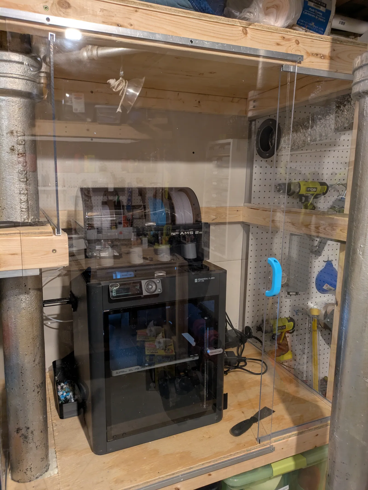
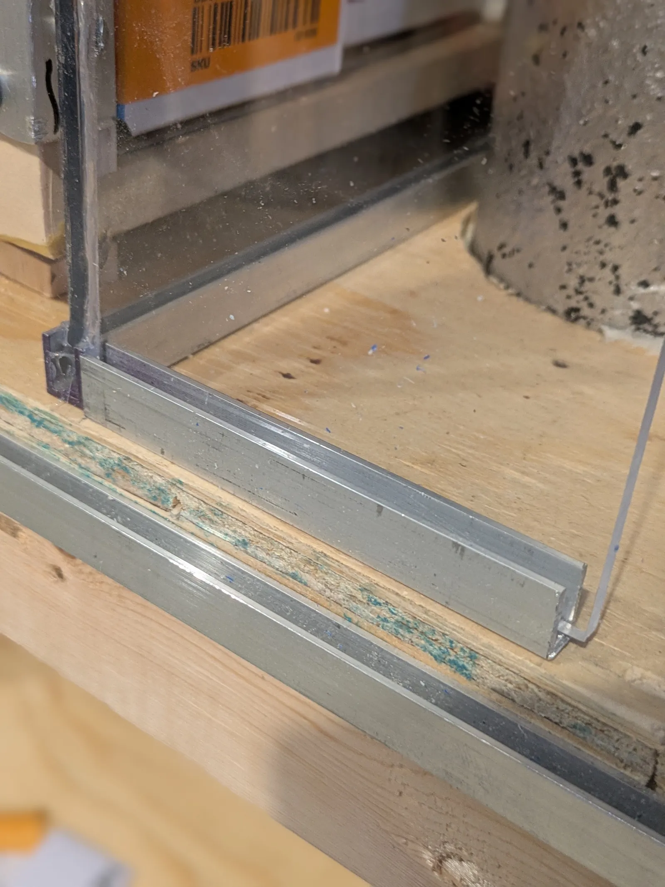
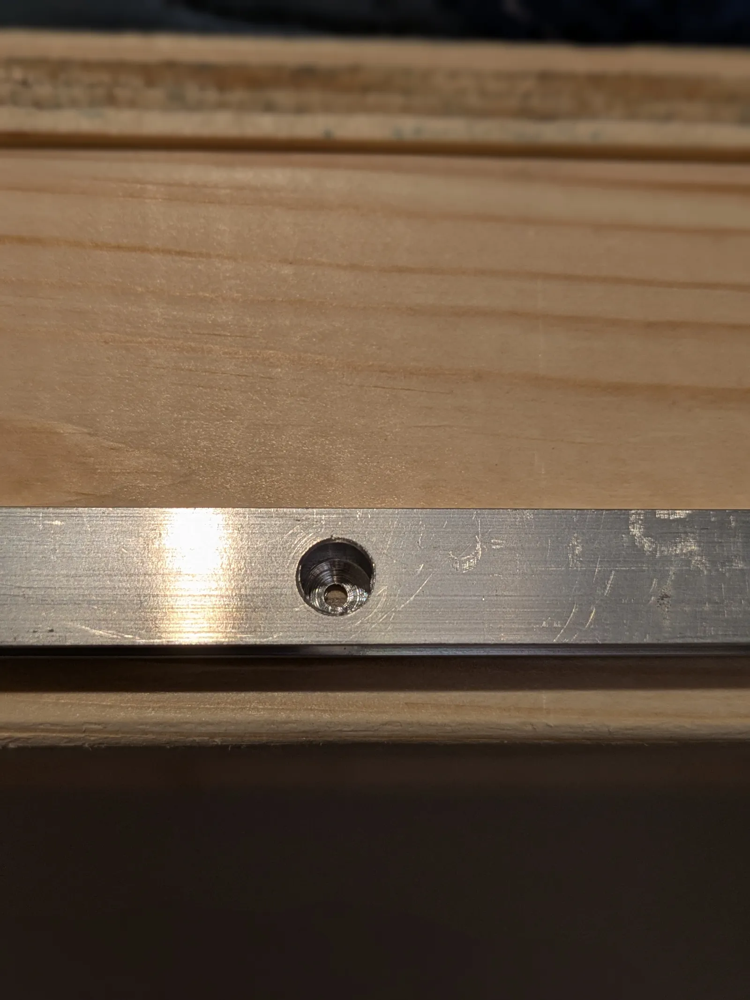
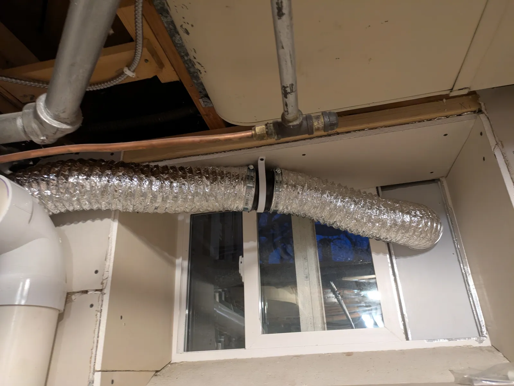
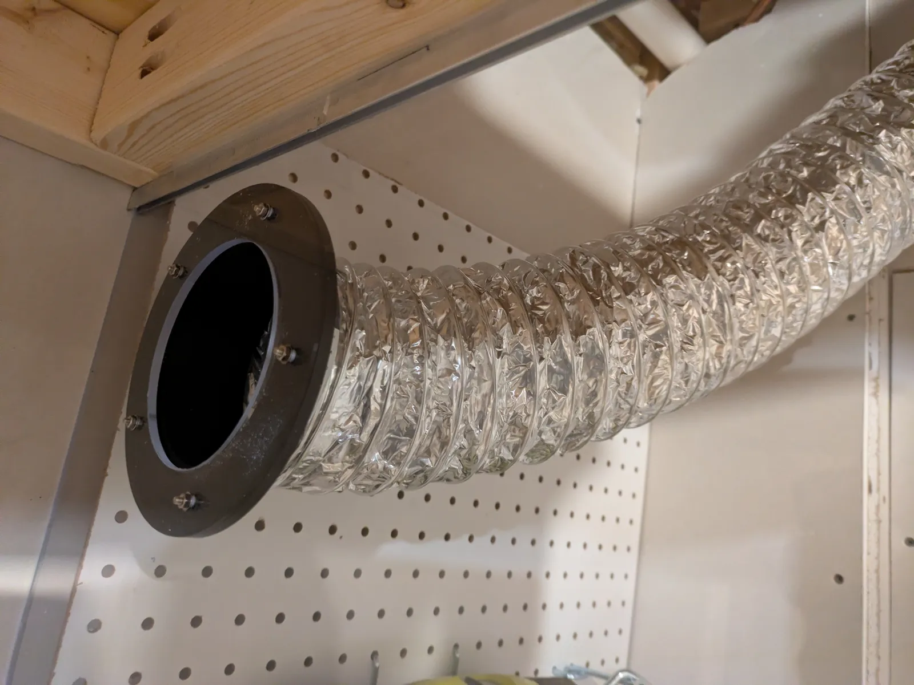
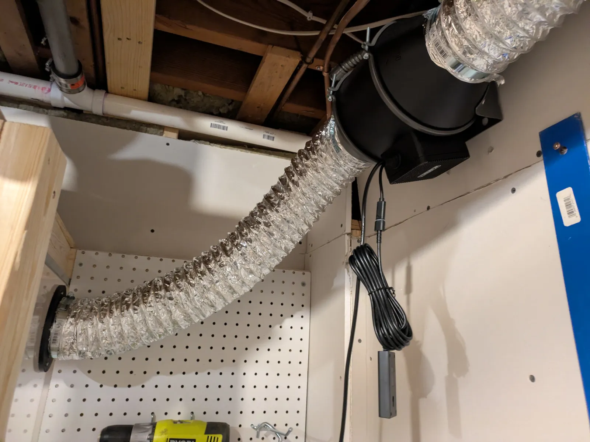
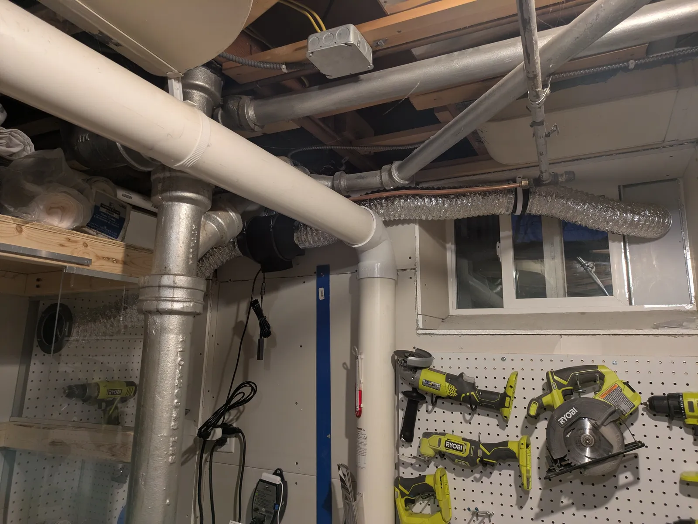

## Introduction

Some 3d printing filaments are considered safer (PLA, PETG, TPU) than others (ABS, ASA, PC, anything with carbon fiber or other additives), but all of them give off some level of VOCs and particles that can be hazardous to your health. There are a number of ways to mitigate these hazards, including physically isolating the printer in an area that doesn't mix with the air you're breathing or using a variety of air filtration devices. These work to some extent, but the gold standard is to ventilate the exhaust air of the printer directly to the outside. In this post, I'll describe my DIY solution for doing just that.

_The finished enclosure_

* Project Difficulty: Beginner to Moderate, depending on enclosure material and design.
* Project Time: Up to 6 hours.
* Project Budget: $150-400, depending on material choices.

## Design

The printer I need to vent is the Bambu P1S, which is an enclosed printer. In my research I found a number of solutions that involve putting some sort of manifold directly onto the exhaust fan output of the printer and then ducting that to the outside. I feel there are a number of downsides with this design.

1. The exhaust fan itself doesn't move enough air to overcome the resistance of the exhaust duct, including any bends, grills or dampers you have along the path. It's possible this would just generate backpressure, pushing more air out of the enclosure along other pathways (see #2). You could boost the output flow with another fan inline in the duct, but then you run a different risk: expeling too much air from the chamber, therefore drawing too much surrounding air into the enclosure and lowering the enclosure temperature too much, affecting your prints.
2. Printers generally have more than one hole for air to escape. My Bambu P1S for instance has a large opening to expel the purge filament, a decent air gap all around the front door, and a couple of other enclosure openings. It's not clear that I could create a strong enough system to overcome all of that and create a negative pressure environment within the enclosure without running into the "too much air being drawn in" problem.
3. Sometimes you might want to print with the enclosure door or top open to achieve lower enclosure temperatures which work well for certain filaments and prints, which would render this solution ineffective.

I decided on a more complex but effective approach.

### Yes, You Need to Enclose Your Enclosed Printer

Putting another enclosure around an enclosed printer solves these issues. You can pull a lot of air through that space without affecting the environment within the printer enclosure much, so it's easier to create a negative pressure environment, and no matter which path VOCs and particles use to escape the printer enclosure, they'll be entering that negative pressure environment and be pulled towards the exhaust.

From there, it's just a matter of having an effective ducting system to the outside. How you achieve that is going to be dependent on your setup, but in general, get the printer as close to a window as possible (or, if you are willing to put a permanent penetration through your exterior wall, to that location), and then we'll use a duct with an inline fan to pull air out of the outer enclosure and out to the outside.

You do not need an airtight outer enclosure and in fact, that would work against this solution. You want an enclosure that allows enough fresh air to come in to replace the expelled air without too much resistance, but at the same time, not so porous that it becomes hard to create a negative pressure environment. I'll talk more about how to achieve the right balance and test for negative pressure later in this post.

### Be Thoughtful About Duct Design

My main lesson learned in this project is that you'll need bigger ducts and a more powerful fan than you think. It LOOKS over-engineered, but during this project I discovered that this was what was necessary to create an effective ventilation system. You'll want to use 4" ducting and a fan powerful enough to overcome the resistance of the duct's walls and bends as well as have enough force to open any dampers along the way. As much as possible, keep your duct run as short and straight as possible. This project is about keeping yourself and your family safe, so this is not an area to skimp out on.

## Project Implementation

The basic implementation plan is:

1. Build the enclosure.
2. Create the opening to outside.
3. Build and route the exhaust duct.
4. Test function.

### Outer Enclosure

There are a number of ways to achieve this, each with their own pros and cons.

1. The cheapest way to do it is to use whatever scrap material you have around (cardboard, plywood, etc...) to create the enclosure. The downside is that this may not look the greatest and makes it harder to see and access the printer when needed, but it can work in a pinch.
2. The next cheapest would be to purchase an enclosure specifically made for 3d printers (basically a tent). Alternately, you can use a grow tent for indoor gardening, since that is designed to solve essentially the same problem. You can find these on Amazon and elsewhere relatively inexpensively.
3. The most expensive option is to build a more permanent custom enclosure.

If you do options #1 or #2, building the enclosure is straightforward (e.g. tape together some cardboard and cut openings where needed, or open a package and expand a tent around the printer...). I don't have directions for those options here.

I chose option #3, using acrylic (plexiglass) in combination with the plywood shelving and drywall in my printer's location in my workshop to create the enclosure. It's certainly more complex and requires more tools than the other solutions, but will also be more durable and functional (and, in my opinion, aesthetically pleasing).

Make sure your enclosure will be sufficiently sized to contain your printer and accessories and allow you easy and comfortable access to all the various areas around the printer, including spool loading and purge cleanup. Make sure to think about future needs - will you upgrade to a larger printer someday? You don't want to redo all of this work if you can avoid it. I actually made my enclosure a bit oversized because I may someday also add a small resin printer, which _definitely_ needs a good ventilation solution.

My printer sits on some utility shelving in my workshop. The shelving butts up directly against the rear wall, so I used that as the rear barrier, and the shelf plywood for the floor and ceiling. The acrylic sheets were used to form the walls and the sliding door. I secured the panels in place with aluminum U channel attached to the floor and ceiling of the enclosure and just slid the wall panels into place in the channel. The front sliding door also slides within U channel that I mounted on the front face of the shelves. The sliding door overlaps the fixed panels on either side by about an inch or so to allow for sufficient air to enter but not create a large opening. You could also use a hinge-mounted door if that works in your environment. Because of a plumbing stack in the vicinity of these shelves, I don't have that option in my setup.

_Various components of the enclosure: side panel meeting short fixed front panel, track for sliding door mounted in front._

Cutting the acrylic was straightforward - my sheets came with protective film on both sides so I didn't have to worry about scratching it. I clamped on my 4' T-square as a saw guide and ran the circular saw with a fine-toothed blade. It makes a bit of a mess, but otherwise went smoothly. If you don't have protective film on both sides you can tape it with painter's tape to avoid scratches.

The most finnicky part was creating the screw holes in the aluminum channel. You need to countersink the screws so they don't interfere with the acrylic panels. I do have countersink bits to make such holes, but the channel was not wide enough to accommodate them, so instead, I just used a small drill bit to make the initial screw hole, then a much larger bit to go _partially_ through the aluminum around the smaller hole to make the countersink area. Be careful here, too much and you'll have a way-too-large hole through your channel. I also needed to go through the channel from the side to mount the sliding track, and this required a large enough hole on the outer edge to fit a screwdriver and then the same two-step countersink creation on the inner edge, working through the outer hole. It's also possible that I could have epoxied these channels in place instead, but screws seemed like a surer bet.

_Difficult to see, but I've made an outer hole large enough for drill bits and screwdriver, a small inner through hole for the screw, and a partial hole with the larger bit to make the countersink._

Remember to drill the holes for the exhaust, the cord passthrough, and the handle mount before mounting sheets. Do yourself a favor and figure out how you're going to attach the duct to the exhaust opening now. I used 4" flexible duct, so I 3d printed a 4" duct flange (link below in the exhaust section), used that as a template to mark where the screw holes would need to be, and drilled out those holes around the exhaust opening. When drilling screw holes in acrylic you want the hole bigger than the screw so you don't crack the acrylic - the screw should not need any force to go through the acrylic.

Once that was done, it was just a matter of sliding in the sheets and running silicone beads where they met.

#### Enclosure BOM

Here is everything I used for the enclosure.

Materials

* Acrylic (Plexiglass) sheets. I ended up needing (Qty 4) 4' x 2' x 3/16" sheets for my particular space. 3/16" thickness is the sweet spot - stiff enough to resist flexing, less heavy and costly relative to 1/4". I purchased online at [buyplastics.com](buyplastics.com) but there are a number of online vendors as well as your local home improvement store that can supply acrylic sheets.
* 1/4" wide aluminum U-channel. 1/4" U channel allows the 3/16" sheets to slide in without too much tightness. Purchased from my local home improvement store, I needed 28' of it.
* Clear silicone caulk to seal the edges where panels meet.
* Countersink screws to attach the U-channel without blocking panel insertion/sliding.
* Handle for sliding door. 3d printed.
* Grommet to seal off the power cord passthrough hole. 3d printed with TPU.

Tools

* Circular saw to cut the acrylic. Table saw would also work well. Fine toothed blade required. Clamps/saw guides/square/tape measure.
* Drill and bits to make mounting holes for the ducting and handle as well as to create the screw holes to mount the U channel. Metal jigsaw bit to cut the aluminum U channel.
* Screwdriver (manual or power is fine, these are tiny screws holding the U channel).
* 3 3/4" hole saw for the drill to make the opening for the exhaust duct. You could hand cut this with a jigsaw or similar, but it'll be harder and not as neat.
* 2" hole saw to make hole to pass through power cable. You could go smaller, but 2" is a standard grommet size.

### Outside Vent

The most common way to vent to the outside is through a window, and there are purpose-made kits that are designed for use with portable air conditioners that you can use to achieve this. I used one of the many 4" duct clone kits you'll find on Amazon that are designed to fit a wide variety of window types and sizes. Just make sure to get a kit that is designed for a 4" round duct - some portable ACs have differently shaped exhaust ducts.

_My window vent setup_

Once I installed the kit per their instructions, I sealed around all edges with weatherstripping (my kit came with some), then used foil tape to further seal off any potential drafts. I plan to eventually make a little foam insulation cutout to go around the window vent as well.

You could certainly DIY up your own window vent with some plywood and another duct flange as an alternative to save a bit of cash. Or, if you really want to go professional, you could make a permanent cut throug the foundation and install another dryer-style vent.

Whatever solution you go with, you probably also want some sort of damper or louvers and screen on the outer side of the opening, to prevent critters from getting into your duct. My kit came with a plastic louvered cover and a screen. This is not a substitute for a proper duct damper, though (see next section).

#### Vent BOM

* [LBG Products Window Kit from Amazon](https://www.amazon.com/dp/B0F9WT7QFF?ref=ppx_yo2ov_dt_b_fed_asin_title).
* Foil tape. I had some in the workshop.

### Exhaust System

I originally designed the exhaust system around 3" ducting thinking that the more common 4" ducting (typically used to vent clothes dryers) was overkill. Long story short, I was proven wrong - just go with 4" ducting, you'll save yourself some headaches.

To create the exhaust path, I first attached the 4" flex duct to the enclosure using a 3d printed flange and gasket along with M3 screws, washers and nuts. The TPU gasket is probably optional but I figured it would create a better air seal and distribute the pressure more evenly across the acrylic (and, let's be honest, I wanted to try printing TPU). I used a hose clamp to attach the duct to the flange.

_The mounted vent flange. You can't see it well but there's also a 2mm wide TPU gasket between the flange and outer acrylic._

The fan I am using is the AC Infinity CLOUDLINE PRO S4 inline duct fan. AC Infinity is a well-known brand in the indoor grow space. I originally tried to do this project with their cheaper Raxial inline booster fan, but it was nowhere near powerful enough to do the job, so I returned it and upgraded to the S4. I mounted the fan on the wall using its mounting bracket and hardware. I routed the duct to the fan inlet and attached with another hose clamp.

_Connecting to the Fan_

I then exited the fan with more duct and another hose clamp and routed the duct to an AC Infinity inline 4" damper that I mounted in my window well with a 3d printed bracket. 

_Notice the inline damper mounted in the window well._

The damper has spring-loaded thin metal "butterfly" plates inside that are pushed open with air pressure and snap shut and create an airtight seal when the fan is not operating. This prevents backdrafts from traveling back up the duct from the outside into the enclosure. It's -5 degrees farenheit here in Minnesota as I write this, so for my environment this is not optional. You want the damper to be close to the outside opening to minimize the length of duct subject to backdrafts.

Finally from there it's just two more hose clamps and a short length of duct to the window vent.

_The finished ventilation system within my workshop_

#### Exhaust System BOM

* 4" duct flange. 3D printed using [design from user @DeGnoss_982904 at Printables](https://www.printables.com/model/607131-customizable-duct-flange). The flange is fully customizable using free OpenSCAD software.
* Gasket. I created the design by modifying my flange STL in Tinkercad to simply remove the flange part and keep the lip. Then I printed in TPU. This way the screw holes were already there and perfectly positioned.
* 4" flex duct. I bought 20' of it from my local home improvement store.
* Hose clamps for 4" duct. I used 6 of them. Local home improvement store.
* [AC Infinity CLOUDLINE PRO S4 fan](amazon.com/dp/B07JB292JC?ref=**ppx_yo2ov_dt_b_fed_asin_title**).
* [AC Infinity 4" backdraft damper](https://www.amazon.com/dp/B0842XSTV9?ref=ppx_yo2ov_dt_b_fed_asin_title&th=1).

### System Testing and Operation

With everything in place it's time to test the system to make sure it actually does the job it was designed to do! To test, I closed the sliding door, put the fan on a medium setting, and did an informal "smoke test". I lit and extinguished matches and held them _outside_ the enclosure close to air openings (e.g. around the sliding door) and checked that the smoke from the extinguished match was sucked into the enclosure. I did this at a number of locations around the front door and anywhere else I saw a small air gap (which wasn't much since I went around with silicone to seal things off). Incense would probably be easier to use than matches, but I didn't have any on hand. Once you've tested all the potential air inlets, you can optionally do internal smoke tests to better understand how air is flowing within the outer enclosure.

Other methods for testing include holding paper up to openings and ensuring it gets sucked inward, or hanging thin strips of tissue in the enclosure and observing how they move, but I found both of those methods less reliable and sensitive than the smoke test.

Convinced that the fan was maintaining a negative pressure environment within the outer enclosure, I went outside and verified that I could visually see the louvers on the outer grill being opened and feel airflow there with my hand. I fine-tuned the adjustable fan speeds to figure out the slowest speed that reliably maintained negative pressure, opened the inline damper, and opened the outside louvers. That's the lowest (and therefore quietest) effective setting. Setting the fan on higher settings would move more air but also may have more of an effect on the inner printer enclosure environment than is necessary, so I plan to use my fan at this "sweet spot" speed.

#### Set-and-Forget Setup

You could certainly just operate the fan manually when needed, but I wanted to make this setup truly set-and-forget reliable. I used a smart plug with the fan and utilized my Home Assistant environment to automate fan operation. Since my Bambu P1S is already integrated to Home Assistant, I receive events when the printer's state changes. I set up an automation to turn the fan on when the status changes to Print Started, and to turn the fan off ten minutes after the status changes to Finished or Failed or Error (basically, all the state changes that mean the printer stopped printing). The ten minute delay is to allow for residual VOC and particle clearing.

For this to work, it's important to verify that your fan returns to its previous speed when power is interrupted and restored. Luckily, the AC Infinity S4 does exactly that.

I will eventually put in some sort of "exhaust failure" detection. I've thought of a couple of different ways to approach that - I could use a smart plug that reports real time voltage draw and monitor that which would be simple, or more directly with a little more work, I could insert an airflow sensor directly in the duct. It's on my todo list for the next few weeks.

## Conclusion

With this system in place I can rest easier knowing that I have taken reasonable precautions to prevent harmful VOCs and particulates from entering my home. It's quite possible this is an overengineered solution, but with concerns as simple as headaches from fumes to as serious as cancer-causing particulates, and relatively little good data to truly understand the health effects of 3d printers and filaments, I feel like this was a worthwhile investment in my family's health and safety and my peace of mind. Plus, I learned a lot, and I also think it makes my printer setup look a little nicer, as well!

What ventilation solutions have you come up with? Did this post help give you some additional ideas? Got questions or suggestions? Share in the comments below!
