## Introduction

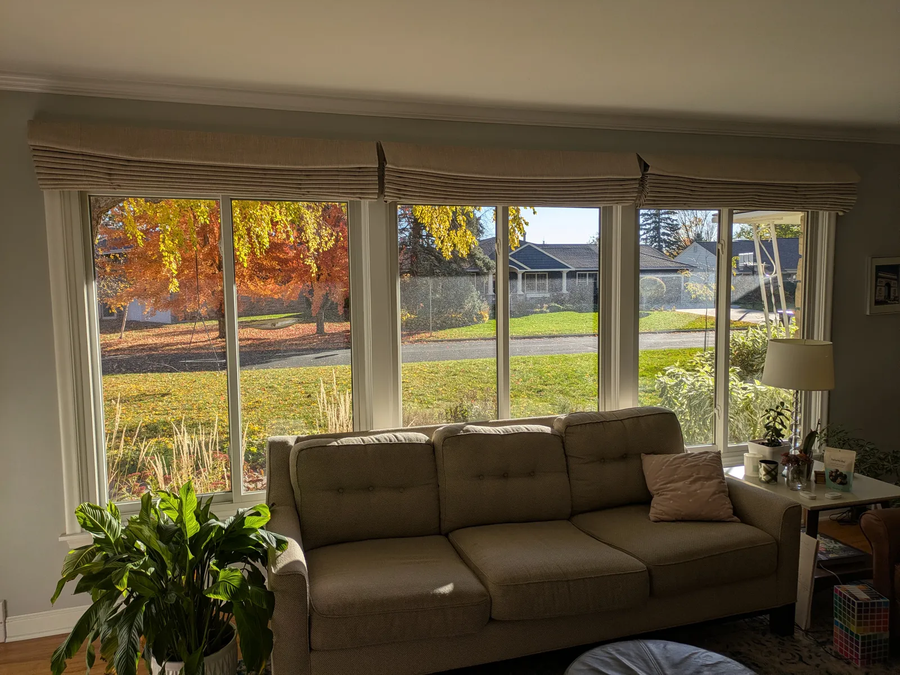

The shades on these three large windows in our living room behind a couch were difficult to manually open and close, so a few years ago we splurged on an upgrade to motorized battery-powered, RF-remote-controlled Motiva shades from Smith and Noble. These worked great for a few years, with the only annoyance being that as the batteries discharged they would start to move at different speeds, making it difficult to stop them in the same location. As long as we remembered to charge them every few months, this mostly wasn't a big issue, but recently one of them developed a problem where the motor battery would no longer recharge. It still works, but only if we keep it plugged into its charging cable at all times, which is inconvenient and unsightly. I've been meaning to get around to a fix, but six months later the charging cable was still hanging off of it... you know how that goes.

Last week I finally got motivated to fix the issue. My plan was to simply source a replacement motor, but this proved surprisingly difficult. Smith and Noble has merged with another blinds company and it's difficult to find accurate information about Motiva blinds any more (tbh, it never was easy in the first place). I had to physically disassemble the blinds and get at the motor assembly to see what I was looking for. Once I did this and learned a bit more about how these devices work and what I would need to do to replace the defective motor and integrate the new one into my system (and realizing just how much markup Smith and Noble put on these shades!) I started daydreaming up a project...

I've recently been rebuilding my smarthome infrastructure from the ground up. One of my goals is to keep everything in-house and break free of all of these various ecosystems I'd been using to manage the house. We had some devices on Smartthings, some on Wyze, some on MyQ... it was getting unwieldy, and I really don't like being tied into all of these corporate clouds. Over the past six months I've been building out robust Zigbee and Z-Wave networks and a Home Assistant-based management platform. As I was shopping around for shade motors, I started to wonder what it would take to integrate my blinds into my smart home system. It would be great to have an open system that I understood front to back and had more control over. It would also be an opportunity to hard-wire the blinds and never have to worry about blinds getting out of sync, recharging, or batteries dying again!

Here's how I converted my Smith and Noble Motiva RF-controlled, battery-powered motorized shade system into a DIY, hard-wired, smarthome integrated system. The project is not that hard - just pay attention to details, pause to research questions if you are uncertain, and you'll be fine, even if you don't have a lot of experience with this sort of thing!

## Parts List and Budget

My plan was to replace all three RF-controlled, battery-powered motors with no-battery, no-wireless-communication, just-plain-old-DC-motors-with-two-wires tube motors, and then add my own Zigbee or Z-Wave controller to each motor for control, wire it all together with hard-wired 12V DC so there's no more power management to worry about, and finally integrate it into my smarthome environment so I could use a simple remote to operate them.

I sourced the motors from Rollerhouse. From removing the old motor I knew it produced 0.7 nm of torque, used 0.8A of power, ran at 34 RPM, and had 7V DC input. From measuring my tubes I knew I was dealing with 1.5 inch/36mm ID tubes, which is an industry standard size. This info is what I needed to figure out which motor I needed from Rollerhouse - which was the ES2512, a 12V DC, no radio, 0.7 nm torque, 7.2W (so 0.6A, more efficient than the originals), 34 rpm motor compatible with 35-38mm tubes. $59 each on Amazon, and they include the adapters needed for my 1.5" tubes. Whatever you use, you want the plain 2-wire DC version for this project.

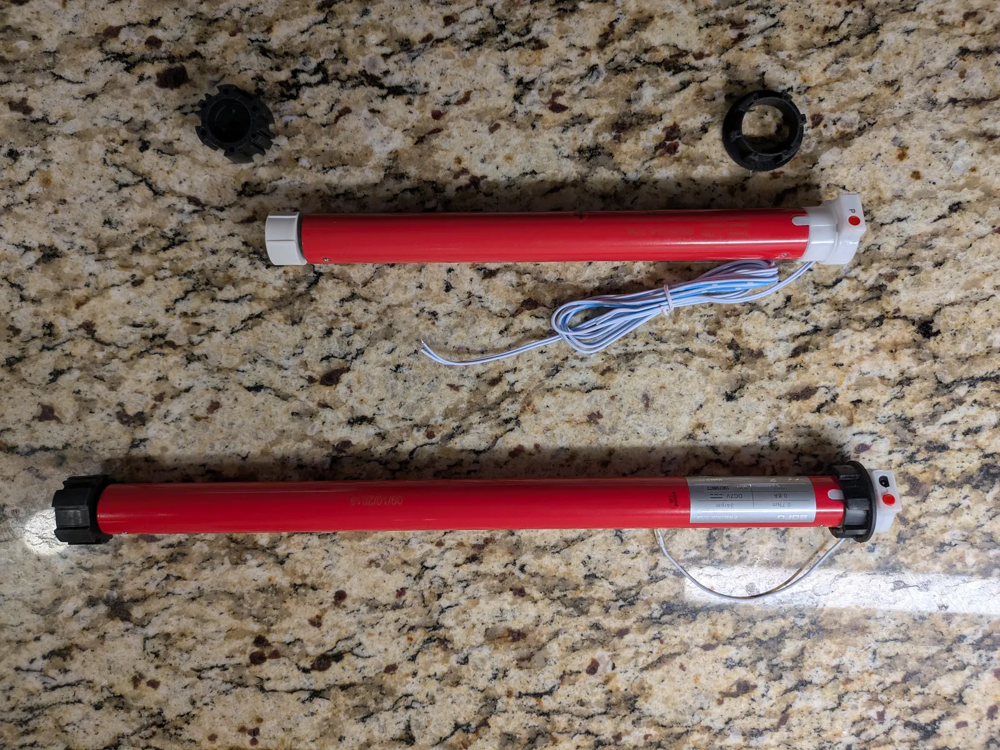_Old motor (bottom) and new motor (with size adapters)_

For motor controllers, you can find lots of Zigbee and Z-Wave options, but for reliability, I tend to opt for Z-Wave when I need something that's just going to work and not give my family a lot of headaches (they have way less patience for smarthome quirks than I do). I've had great luck with Zooz Z-Wave products, and luckily they make a controller for this exact purpose, the Zen53 DC motor controller. Sourced from [The Smartest House](https://www.thesmartesthouse.com/products/zooz-700-series-z-wave-plus-long-range-dc-motor-controller-zen53?srsltid=AfmBOoq0ZUp6rzi5Fw_jlHtigC3A4U1KemU31_4CPdL9iCw7ls-nUcpC) (highly recommend - great service too!), these can be had for around $30 each.

Next, I would need something to transform our 120V AC power to 12V DC. You want to make sure to have enough power to comfortably cover the sum of what your motors will draw. The motors I am using are 0.6A and I have 3 of them, but to give myself plenty of head room, I got a [12V 5A brick off of Amazon](https://www.amazon.com/dp/B00HENQAMS?ref=ppx_yo2ov_dt_b_fed_asin_title&th=1) for $15.

Then you'll need the electrical doodads to tie it all together. First, the wire to distribute the power to each controller (which will live near each motor at the top of the shades). 18 AWG is a good guage for this sort of low voltage application. I got a roll of 100' of 18 AWG in white to blend into my living room, for $20. I used less than half, so you can save a few bucks here most likely, but it's always nice to have extra 18 AWG on hand for projects and repairs.

For making electrical junctions in projects like this I really like the neatness, ease and reusability of [Wago connectors](https://www.amazon.com/Splicing-Connector-Lever-Nut-Assortment-Pocket/dp/B07NKT2P2F/ref=sr_1_13_sspa?crid=10WKW16L0O8Q8&dib=eyJ2IjoiMSJ9.ebk7QVsm44lQpIWHhMK405PmnQuniNHTXBQg8uYtRSthUJLRUCxQcQHXVuFEIpxDazzZye561cZunUrpYADeZztogQ32qmFWI2hOKjnxot2cTWonyiztF1ymN0NbY4P2pL3bJABaF5ki2hu84aln-AOjkv8N_1FHAWSecB1eE14d3UEse_rOsSz4XNAhO-lvogmHmY26vie4OCu7C6b3m4aks0VqTxUVimtvY8QVt5FYi0eRBCeC1UR3A0P4uDwDDTGq-dnRH0OMPLXlb94tY9J_1EXXP90DzquOSbBFKko.Ahj5TYE2-QPFtUqZNkbfwNBvOqQfZrw9GiulV-ZBwvI&dib_tag=se&keywords=WAGO+221&qid=1764213805&s=hi&sprefix=wago+221%2Ctools%2C118&sr=1-13-spons&sp_csd=d2lkZ2V0TmFtZT1zcF9tdGY&psc=1), so I grabbed an assortment pack for $20. You can definitely do this cheaper with wire connector nuts if you wish, just make sure to get something that can accept 3 conduits of 14-24AWG (the motor wires are stranded 24AWG, and you never know exactly what you'll get out of your transformer).

This next part is optional but recommended - you should consider placing fuses inline at the transformer and at each motor to protect the devices and your house. It's very unlikely anything catastrophic would happen with the low voltage application we're dealing with here, but this is an easy and cheap safety enhancement. I bought a set of 10 inline fuse pigtails with an assortment of fast-blow fuses [from Amazon for $10](https://www.amazon.com/dp/B08KZPFRXF?ref=ppx_yo2ov_dt_b_fed_asin_title&th=1). You'll want 1.5A fuses at each shade and somewhere around 4-5A at the main power feed - you want headroom to avoid nuisance trips, but not so much headroom that its outside of safe parameters for the gauge of wiring you are using. In theory with three 0.6A rated motors my max pull would be 1.8A, but motors will produce a surge at startup so it might be somewhat higher sum total if all three start at the same time. 4A ought to be enough headroom on the main feed.

Finally, consider how you're going to make this look neat and tidy. I bought some plastic project boxes. I got [one bigger one](https://www.amazon.com/dp/B0DC6JMGMM?ref=ppx_yo2ov_dt_b_fed_asin_title&th=1) (200 x 120 x 56mm) to hold the power brick and junction to my main 18AWG power cable run, and then [smaller ones](https://www.amazon.com/dp/B0BQYMY8GL?ref=ppx_yo2ov_dt_b_fed_asin_title&th=1) (90 x 70 x 28mm) that would sit near each motor, to pull a branch of power off of the main run, hold the DC motor controller, the fuse, and all of the necessary connections. All told, I was out $20 more at Amazon. These would also be candidates for 3D printing if you have a decent setup. Think about placement before ordering - there's generally not a lot of space up in the valence area around the motor, so you want to make sure you get something that will hold everything you need it to but not be in the way of the rotating tube or the shade strings - your setup might require something more rectangular, square, flat, etc... I also used some leftover white cable clips I had on hand to help with neat cable routing.

All-in, this project cost me just under $400 or so. It's not the cheapest DIY project, but in my case I was going to have to sink some cash in no matter what to fix the broken shade and by spending more I unlocked several additional benefits beyond just a fix. You could also trim budget in a number of ways on this project - you might have components you could reuse like DC transformers or wire, you could 3d-print project boxes, you could be more patient than me and source some of this from AliExpress...

### Final Supplies Shopping List

* Plain DC tubular motors (no radios, no batteries, spec'ed appropriately) - 1 per shade. I used Rollerhouse ES2512 motors.
* DC motor controllers - 1 per motor. I used Zooz Zen53 Z-wave controllers.
* 12V DC transformer with enough output to cover all of your motors pulling power at once plus some headroom. 
* Enough length of 18/2 AWG conductor wiring to reach from transformer location to farthest shade motor location. Pay attention to color, you want them to blend into your decor. I bought 100' of white 18/2 from Amazon.
* Wire connectors of choice.
* Inline fast-blow fuses - 1 per motor plus 1 for the main power feed.
* Project boxes to contain components at transformer and each shade. There are tons of options on Amazon.
* You may want to pick up some wire clips to route the wire neatly. I have hundreds of those nail-in ones leftover from prior projects and just used them. They were white so they blended well into our window molding.

### Tools You'll Need

You'll need a screwdriver or two, a tape measure, possibly needlenose pliers, a drill and possibly some screw anchors and screws (for mounting project boxes), and a wire cutter/stripper. I also used my multimeter to test my wire work, but this is optional.

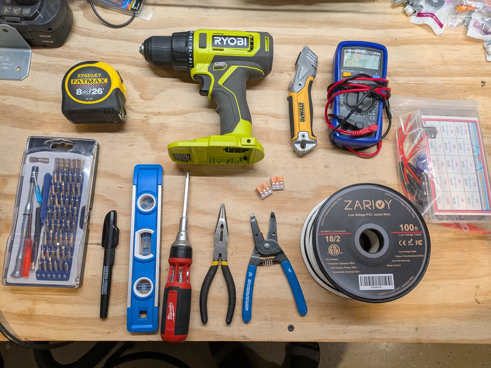

## Project Implementation

The general plan for the project is:

Plug on the wall -> transformer to convert to 12V -> 18/2 AWG wire to the first junction box near the first shade's motor -> branch off to that motor's controller and then on to the motor, while also extending the main 18/2 AWG power feed to the next junction box -> repeat until you reach the end of your shade set.

Find a spot near your shades which has convenient access to a power outlet for the transformer. This is where you'll start and where you'll eventually mount your transformer project box.

### Preparing the Main Power Run

In this step we'll lay the groundwork to get power up to all of the shade locations.

1. Mount the box to your wall or wherever you are going to house it. You will want to be near a power outlet.
2. Prepare the transformer (while it is unplugged!) Cut the barrel tip off of the transformer - in fact, you can cut most of this wire off and leave a foot or so near the transformer if you want. Peel back a couple of inches of the outer cable casing. Carefully open the casing with a utility knife if needed, taking care not to nick the inner cables. Once you've exposed a couple of inches of the two inner cables, strip the tips back approximately 1 centimeter using a wire stripping tool. You should have one red and one black cable. We'll use red for DC power supply and black for ground throughout the project.
3. Connect an inline fuse to the red wire using whatever wire connector method you prefer. This will be your main fuse for the overall system, so size appropriately for the total simultaneous draw of all of your shade motors, plus a bit of headroom. I did this with Wago connectors. You could do this more elegantly with butt splices but it's all going inside a box anyway. I used a 5A fuse (don't use anything larger than the transformer itself, otherwise you're not protecting anything).
4. Cut a length of 18/2 AWG cable to go from the location where you will install your transformer to the location of the first motor, leaving a little extra so you don't come up just short. You can trim it later.
5. Strip the ends of the 18/2 you just cut. Connect one end to the black and red (post-fuse) wires from the transformer.

    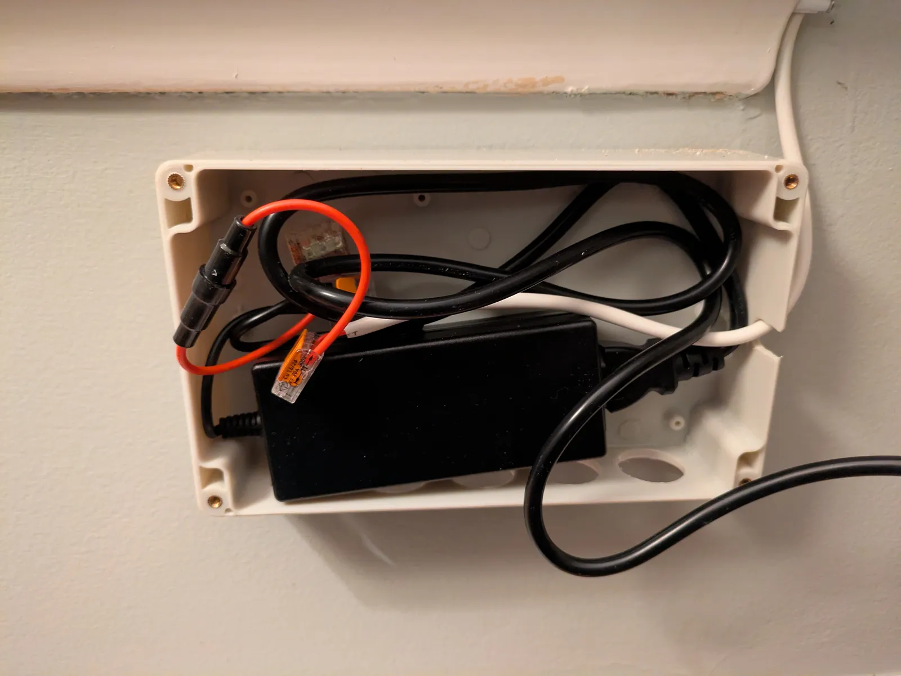
    _The completed assembly with inline fuse folded into its box. Sorry, the red and black inner wires coming from the transformer are obscured here, in the Wago connectors towards the back._

6. Run the 18/2 power distribution wire up to the motor location. This is the time to do your permanent wire install. I used leftover cable tacks to run it up the side molding and then under the valence.
7. At this point you need to figure out exactly where you will make the connections near your motor. I used a little plastic project box that just barely tucked up under my valence out of the way (so barely that it's held there by friction!) Every installation will be different - maybe you have room to tape it to the wall under the valence, or discreetly sit it on top of the valence, or maybe you just need to leave the box exposed, in which case you'll want to choose a nice looking project box to tuck everything into.
8. Once you know where your junctions are going to live, you can cut the 18/2 you ran to the right length. You really don't want a lot of excess, because these boxes won't have a ton of room - a few inches is ok as long as you have room to curl it up in your junction box.
9.  If you have more than one shade you're powering, you'll be making 3-way connections on each wire of the 18/2 (one goes back to the transformer, one goes to this shade's motor controller, and one continues on to carry power down to other shades). If you are only doing one shade, you will just join to the motor controller.
10. If you're doing more than one shade, continue extending the main power run to the additional motor locations.
11. You optionally might want to test that you have power flowing to the end of the line with a multimeter, but otherwise you're ready to mount and close up the 
transformer and the nearby wiring into its project box.

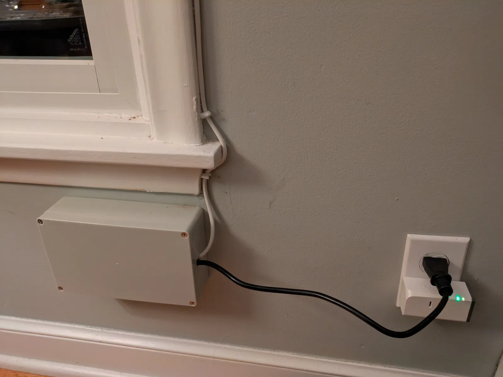
_The box neatly closed_

### Preparing Each Shade

In this step, we'll connect up the motor controllers and motors.

1. First, get the new motors installed in the shade tubes if you haven't done so already, and get the shades installed back in place. How to do this will depend on your old motors and the new ones you bought, but in general, the old motors come out surprisingly easily and these are all based on standard sizes so installing the new motors is pretty straightforward.

    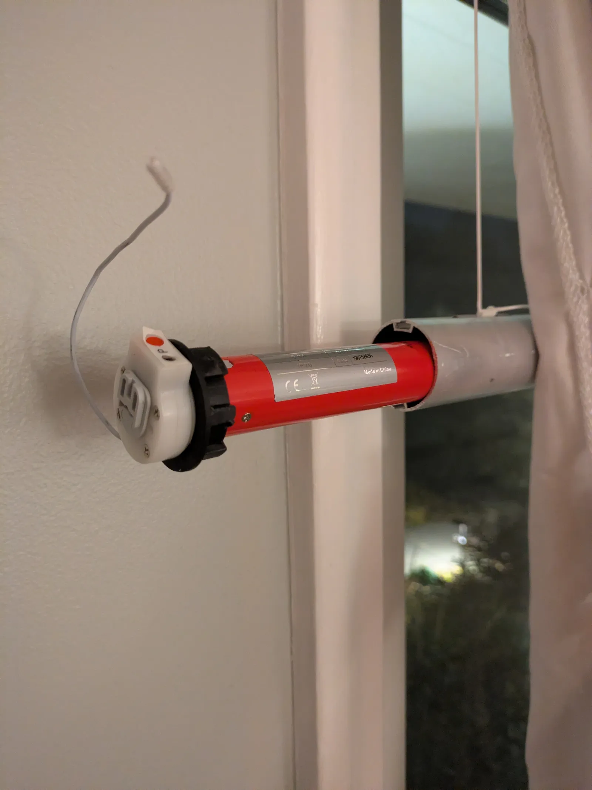
    _With a little elbow grease the old motor pulls out of the shade tube, it's held in by friction only_

    The most difficult part was removing a tiny c-ring clamp so that I could put the larger tube size adapter onto the new motor. I found that the easiest way to remove the C-ring was to push it with needle nose pliers.

    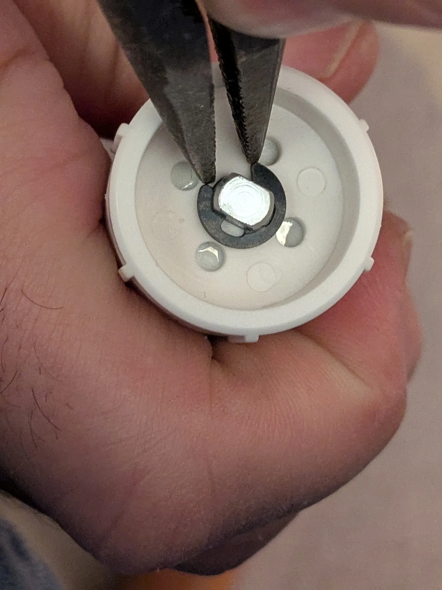

    Once off, you can remove the old adapter and see more clearly how the c-ring works. It grabs the axle in that little groove to prevent the adapter from sliding off the end.

    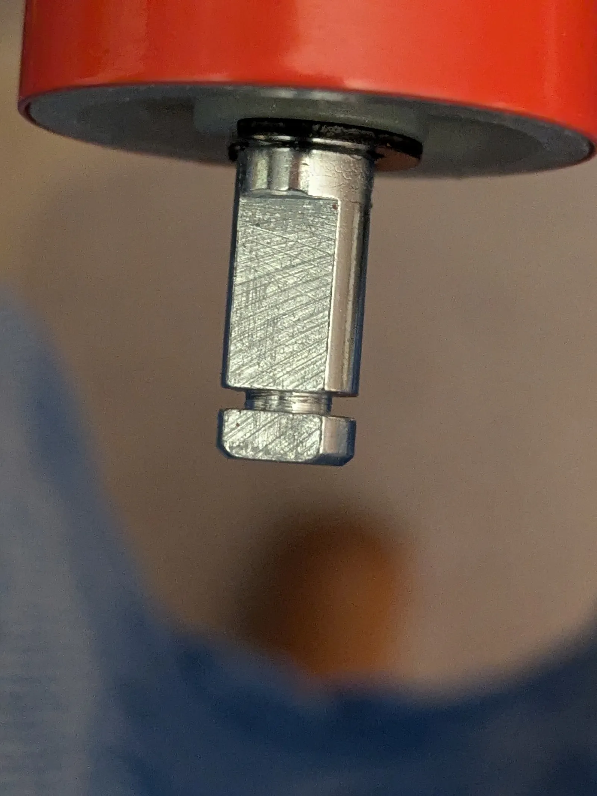

    Pushing the c-ring back on after I installed the new adapter went better with a tiny screwdriver. You should feel it definitively snap into place.

    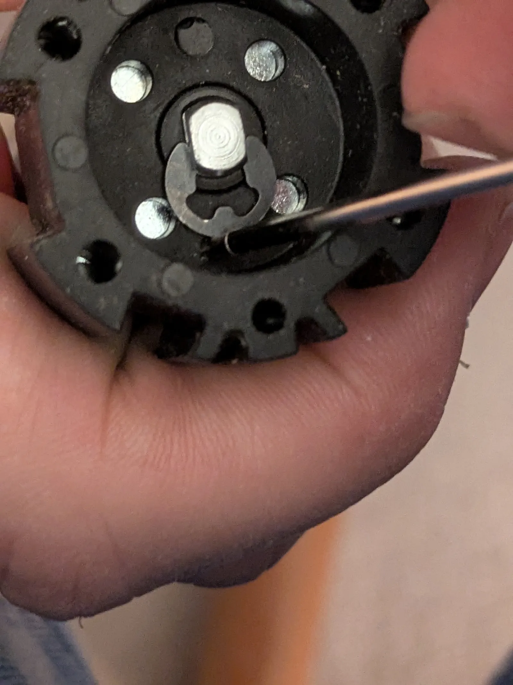

2. Trim the motor wires so that they comfortably reach the junction area without too much excess.
3. At your first motor junction box, attach your DC motor controller to the hot and ground wires. The Zooz Zen53 controllers I used had pre-installed pigtails which made it trivial to join them into the junctions I had prepped in the prior step.
4. Now attach the two control wires from the motor to the motor controller. My motors had one white and one blue/white wire, so I attached white to white and white/blue to blue. If you get this backwards it just means that you might need to change a setting on the motor controller so it knows which way is up and down for the shade.
5. My motor controller also has pigtails to install a physical switch. I plan to only control these via Z-Wave commands so I left these untouched, but you can optionally install a switch nearby as a backup if you'd like.

    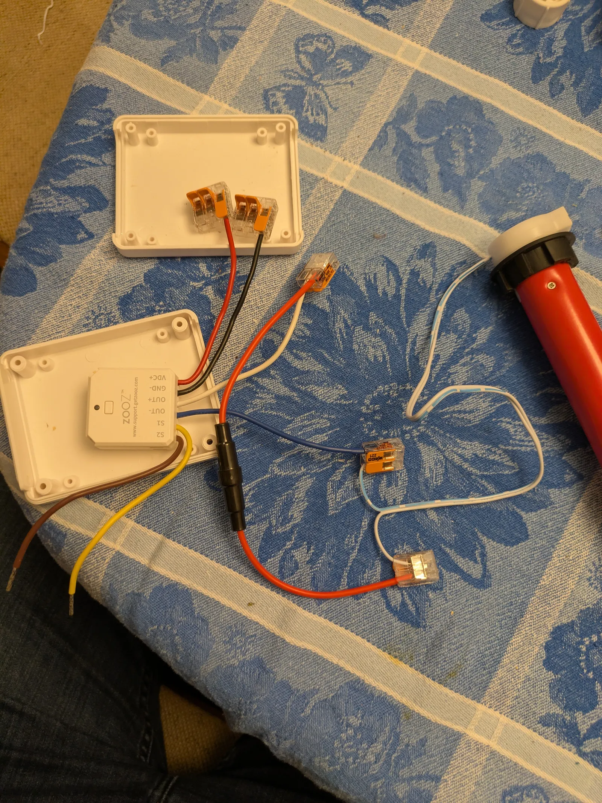

1. Don't tuck everything away just yet. I powered up the system and joined the motor controller to my Z-Wave network, just so it was obvious which shade I was joining and I could easily name it appropriately before I did the other shades. It also gave me an opportunity to test things before I closed up the box.
1. Once you get it joined, test the shade operation. This is going to depend on which controller you're using and what smart home ecosystem you are working in. Home Assistant gives very nice UI controls to control the shade, so it was simple to test that up went up, down went down, and stop stopped the motor.
1. The motor controller at the moment only knows up and down (technically not even that, just turn motor one direction or turn it the other direction). It has no idea when the shade needs to stop, so you need to use the motor's own internal controls for that. For the Rollerhouse motors I'm using there's a control button on the motor that allows you to put it into a learning mode, then move the shade to the desired upper stopping point using your smarthome controls, then hit the button again to teach it the upper stop point, and repeat the exercise for the lower stop point. It was a bit finnicky and took a couple of tries on the first shade to get it to take, but it wasn't that bad.
1. At this point I was able to run my Zen53's automated calibration routine. It runs the shades up and down until it senses the motor stopping, so that it can determine how long the motor runs, which enables you to tell it things like "open the shades 50%". This step is optional if you don't need automated partial opening/closing (you can still do manual partial opening if you program a hold button to run the motors until you release).
1. Once you're satisfied with the first shade's install you can tuck everything neatly away into the project box.

    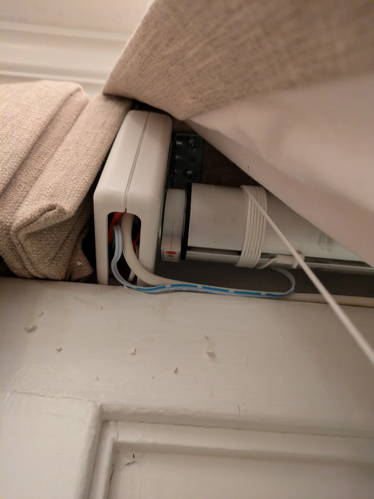

1.  If you've got additional shades to do, repeat these steps until all shades are installed and configured.

### Setting Up Shade Automation

Although you can manually control each shade by directly manipulating each motor controller in your smarthome tools, if you have more than one shade you're probably going to want to operate them as a group. Here's how I set that up in Home Assistant using an IKEA Rodrig Zigbee remote.

The Rodrig is designed to operate a dimmable light - basically click up to turn on, hold up to increase brightness, click down to turn off, hold down to decrease brightness. This can be repurposed neatly to shade operation - I made the clicks move the shades all the way up/down, and I made the hold actions just move the shades until I let go, so I could set them at an intermediate point if I wanted to.

1. I downloaded and installed the IKEA Rodrig blueprint for Home Assistant (but read on for why you might want to skip this). This isn't strictly necessary, but I figured if someone's already done the work to translate the specific actions that the Rodrig emits into a nice, UI-driven blueprint I can just click around and drop in my desired behavior, why not use it? (We'll see why...)
2. I set the press "on" action to open the three shades in parallel and the press "off" action to close them in parallel. This automation works perfectly, the three shades generally fire within a half-second of each other, so they move in unison, which is satisfying. One of the great benefits of wired power is that the shades always move at the same speed. With the battery-driven motors, as the batteries drained, the shades would start to move more slowly, and they would move out of sync with each other, which was annoying.
3. When I went to program the hold action, this is where I hit a bit of a speed bump. The blueprint implemented the hold action as "run the action each X seconds". This sort of makes sense in the context of adjusting a light's brightness (e.g. increase the brightness 10% every half-second), but for shades this was problematic and led to some janky operation, like the shades beeping every three seconds while they were moving because they kept being commanded to move over and over again. What I really wanted was just "when you get a hold event, start running, when you get a stopped holding event, stop running". I ended up creating a separate manual "Window Shade Hold Button" automation without the blueprint to implement this logic. If I were doing this all over again, I probably would just skip the blueprint entirely. The custom hold automation worked perfectly and elegantly and again, because the shades fire so close to one another and run at constant speed, I can stop the shades halfway or anywhere I want, and they look neat and tidy.

At this point, I had all the automation I wanted. I very, very rarely need to control individual shades in this group, so I'm happy just manipulating a shade's motor controller device directly in Home Assistant if I ever need to do that. Depending on your setup and your choice of control, you might want to also program automations for each shade individually or other control methods.

## Conclusion

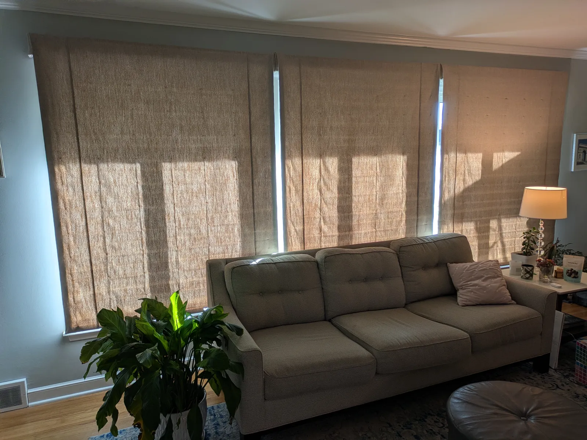

With this project, I successfully broke away from the Smith and Noble Motiva closed ecosystem and integrated my shades into my Home Assistant Smarthome environment. I also gained some quality-of-life benefits by delivering wired power to my shades, meaning we'd never have to climb on the couch to plug in the charger again and the shades would always move at the same speed and never get out of sync and look messy. I've also opened up possibilities for future enhancements, perhaps closing the shades automatically in the evening or operating them as part of a "look like people are home" vacation routine.

