## Introduction

Somewhere on your homelab journey you will eventually come to the realization that you would like to have friendly names for all of the things on your home network instead of dealing with IP addresses. There are many ways to scratch that itch, but one of the most common approaches is to create a private domain. A private domain is simply a domain name that you'd like to use on your internal network that is not visible from the outside world. 

You can create a private domain by running local DNS and DHCP services and pointing your internal devices at them. Here's how I accomplished this with Technitium.

## Choosing a Private Domain Name

This _can_ be an actual honest-to-goodness domain name, but that's not necessary and also problematic if you're planning to use that same domain name for anything public-facing.

The good news is that you can just use whatever domain name you want, including the TLD (the last part of the domain name). If you want your home network to be called `rainbows.donuts`, you can do that. However, there are some pseudo-standards, or at least conventions, that tend to be popular.

Common TLDs for private networks include `.intranet`, `.internal`, `.home`, `.private` or `.lan`. There are a couple I'd recommend not using, as well. `.local`, because that's sort of reserved for something called multicast DNS, or mDNS. In fact, the recommendations I made above come from [Appendix G of the Multicast DNS RFC](https://www.rfc-editor.org/rfc/rfc6762#appendix-G). Another I'd recommend against, even though it's sorta the most official one for this purpose, is `.home.arpa`, which is proposed as a standard in [IETF's RFC 8375](https://datatracker.ietf.org/doc/html/rfc8375). It will work quite well for the purpose, but it's just odd and ugly to me, and is not in common use.

## Setting Up a Local DNS Resolver

For typical home networks, the router will serve as the nameserver. The router isn't really mapping names to IPs (known as resolving) itself - it's typically just a DNS forwarder. A DNS forwarder forwards queries to full-fledged DNS resolvers, and then it caches the results it gets back for faster lookup next time.

Once you have a private domain name, that needs to change. Now you need a local DNS resolver to resolve those local addresses, because no one upstream is going to know anything about your `kookaburra.home` domain. You need something locally that can map these names to actual network IP addresses. There are many solutions here, ranging from the really simple, like putting an `/etc/hosts` file with all of the local names on each machine that needs them, all the way up to running an actual old school bind9 DNS server.

There are also a number of solutions that aim somewhere in the middle of these two ends of the spectrum. One you've probably heard of is Pi-Hole, though you may not realize it can serve this function. Pi-Hole is best known as an ad-blocking solution, but the way it achieves this is useful for our needs here. Pi-hole blocks ads by intercepting DNS queries and cross-referencing lists of known ad-serving domain names. It then blocks those from resolving - known as a DNS sinkhole - so that your local clients cannot retrieve the ads. It forwards non-blocked requests to upstream DNS servers to be resolved. In other words, Pi-hole is a DNS forwarder - at least by default. However, Pi-hole can also be a resolver for local DNS names, meaning that it can map names to IPs for your custom internal domain. If you're already running Pi-hole, see the "Local DNS" section of the settings for more information.

I started my homelab running my own bind9 instance, which appealed to my 1990's sysadmin sensibilities, but I eventually settled on another product which inhabits this middle ground - Technitium. If Pi-hole is an ad-blocker with some DNS functionality attached, then Technitium is a DNS server with some ad-blocking capability attached. Technitium supports a fuller set of DNS functionality than Pi-hole while being slightly less robust (but still plenty useful) on the ad-blocking side. Pi-hole is a DNS forwarder and can be a pseudo-resolver for custom local DNS names, but it's not a real recursive DNS resolver (one which can recursively query DNS servers until it discovers the IP address) without the addition of some additional software like unbound to do the recursive resolving. Technitium is a self-contained package that does all of this, and that's quite useful and handy.

### Step 1: Install Technitium

On the [Technitium DNS download page](https://technitium.com/dns/) you'll find installers and portable apps for Windows, Linux, Mac, Pi and Docker.

Once you have it up and running, you should be able to reach its dashboard on port 5380.

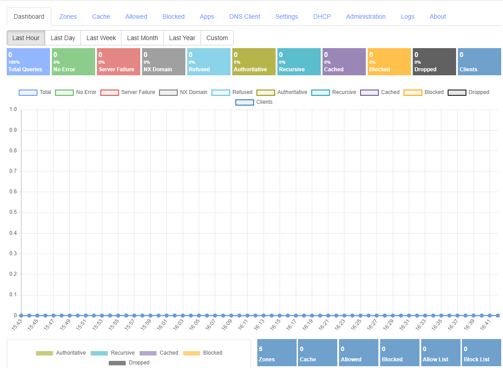

Make sure that your internal network clients can all reach the DNS server on UDP/TCP port 53 (DNS) as well as UDP 67 (DHCP). You may need to do some port mapping in Docker or configure some firewall rules depending on your internal network setup.

For the rest of this tutorial, let's assume that we have a private subnet of 192.168.10.x, with 192.168.10.1 as our router and 192.168.10.2 as our DNS server.

### Step 2: Set up a forward zone

The next thing to do is set up your forward zone which maps names to IP addresses. Go to the Zones tab. You'll see a handful of Internal zones already set up - you can safely ignore these for now. Click the Add Zone button and fill out the form to set up your zone. For the purposes of this tutorial, we'll create `unicorn.home`.

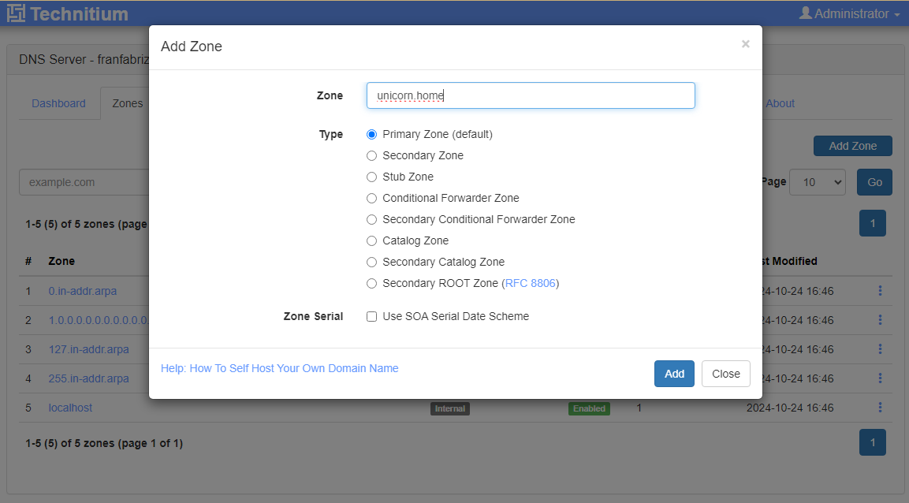

You'll want to keep the default Primary Zone type. Once you create the zone, it gets some default records, like this:

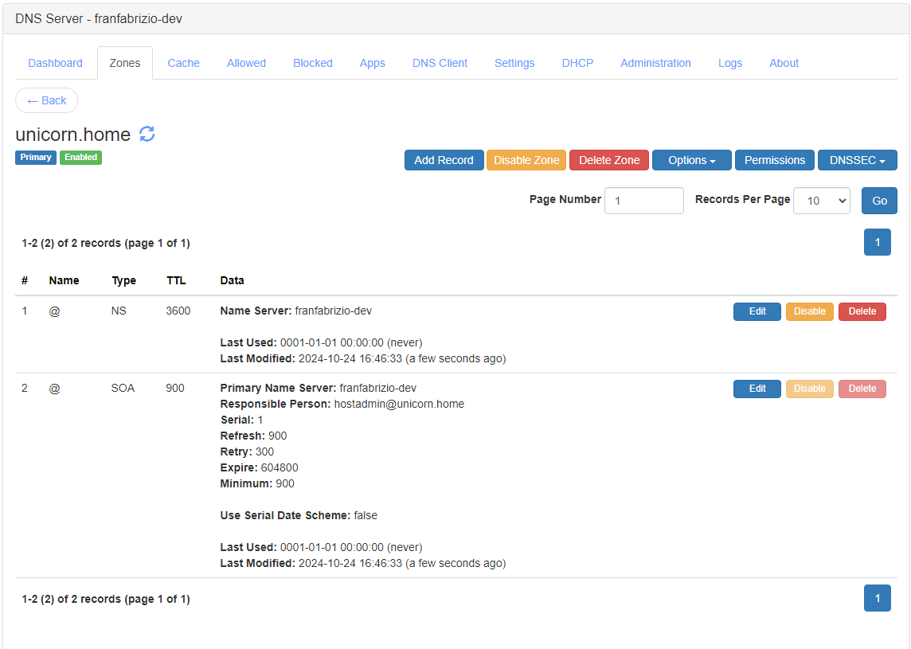

### Step 3: Add DNS entries for your systems

Let's go ahead and add a couple of records for systems on our network. Click the Add Record. Here I'm adding a record for my dockerhost server and mapping it to 192.168.10.20.

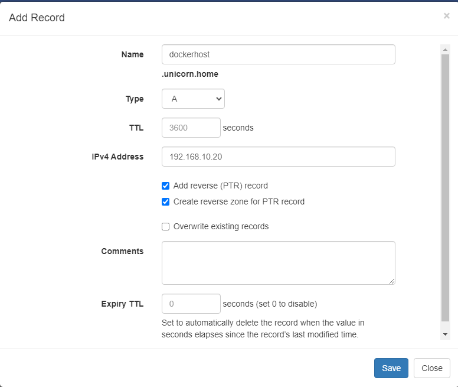

I'm choosing an A record here, that's the standard record to map a name to an IP address. Notice the option for creating a reverse PTR record. A PTR record maps an IP address to a name. This is a less obvious use case for DNS but is helpful in a few situations. For public DNS servers, this is one way that services like email check that the IP address trying to send the email is part of a valid domain, for example. We don't have that concern here, but other use cases are relevant, such as being able to display friendly names instead of IP addresses when using troubleshooting tools like traceroute. More to the point, Technitium makes it easy to maintain a reverse zone, so why not?

I also have to give Technitium permission to create the reverse zone, since it doesn't exist yet.

Once I add the record, you'll see it in the zone:

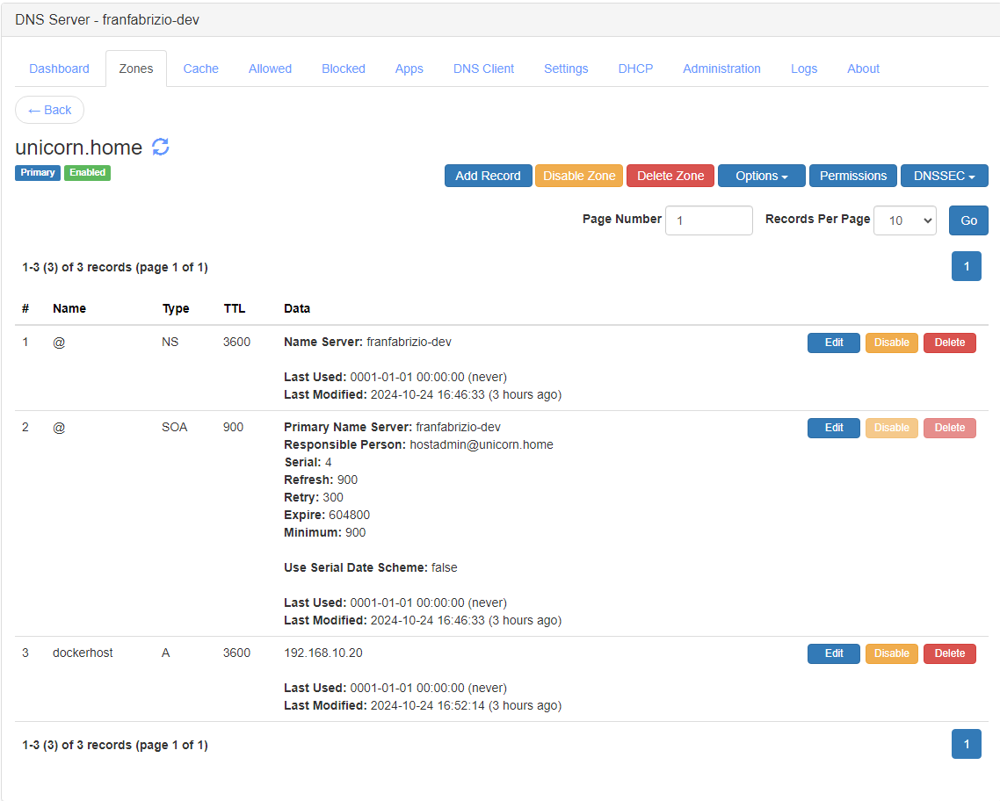

And in the zone list we can also see that the reverse zone is created, there as zone #3.

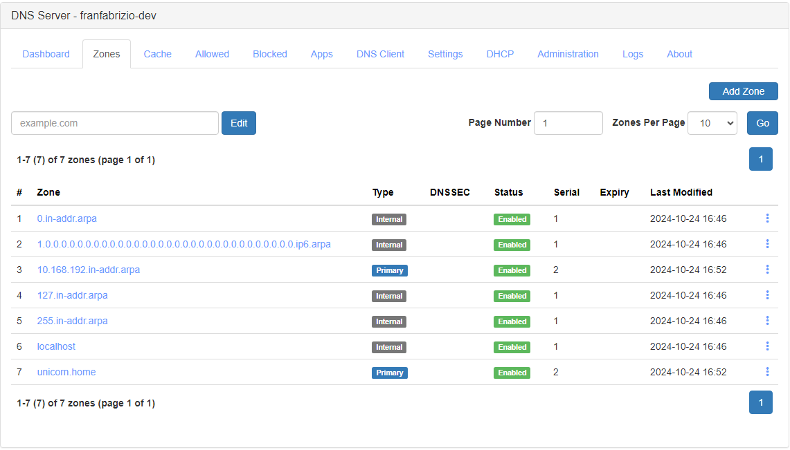

It has the unusual name `10.168.192.in-addr.arpa`, with the subnet 192.168.10 expressed in reverse order. That's just how the spec dictates it should be named. If we look in that zone:

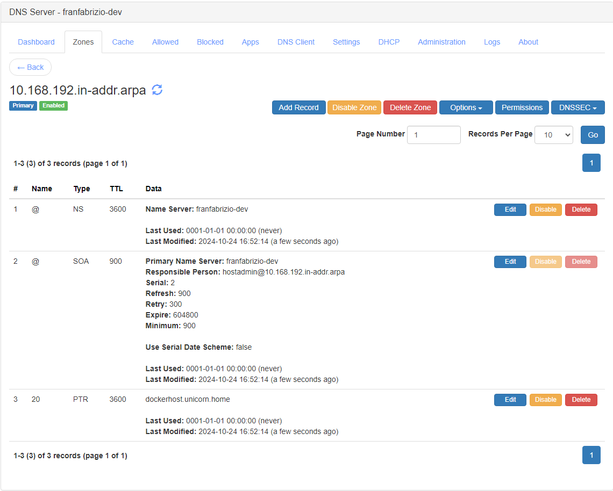

we can see the PTR record that was created for dockerhost as record #3 in that list, with a name of `20` for the last part of its IP address.

Going back to our forward zone `unicorn.home`, we can continue adding A records for our hosts. Here I've added a second one for my NAS appliance, creatively naming it `nas`.

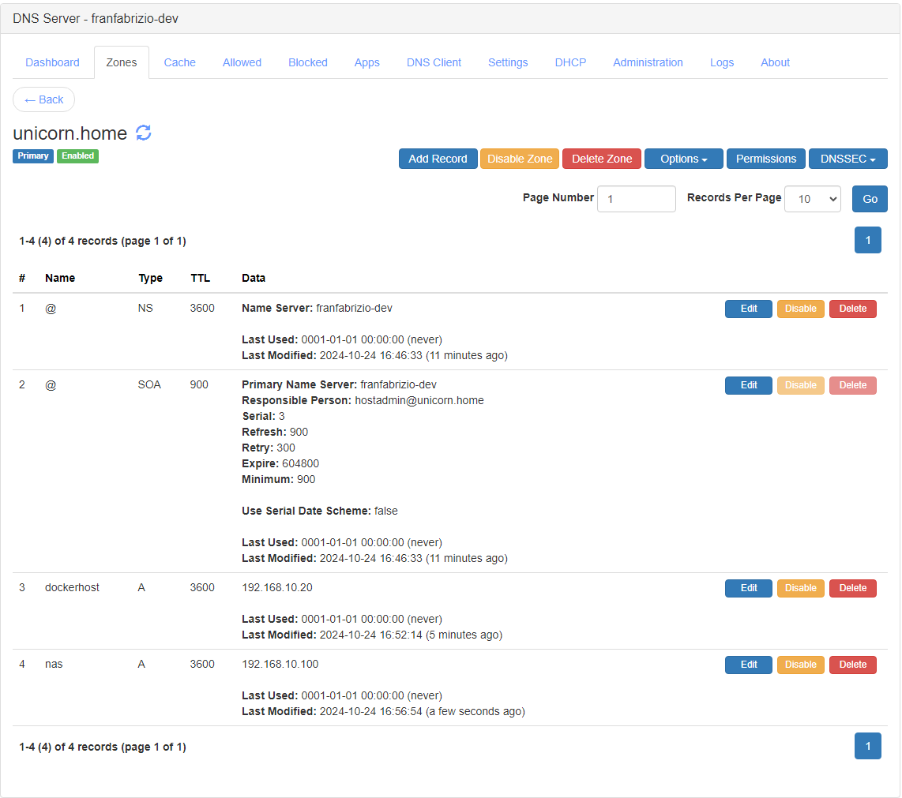

Another useful record type is CNAME, which is an alias to another name. Suppose you also want to refer to your NAS as `files.unicorn.home`. Let's add a CNAME record for that:

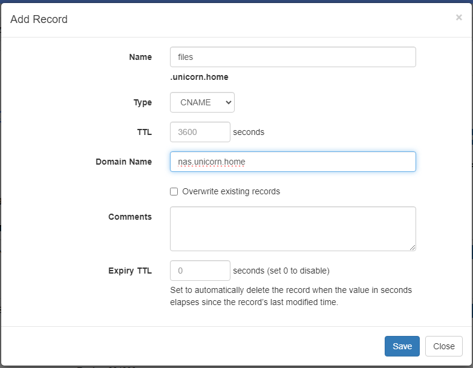

Now you can see both hosts plus the alias we've created in the zone:

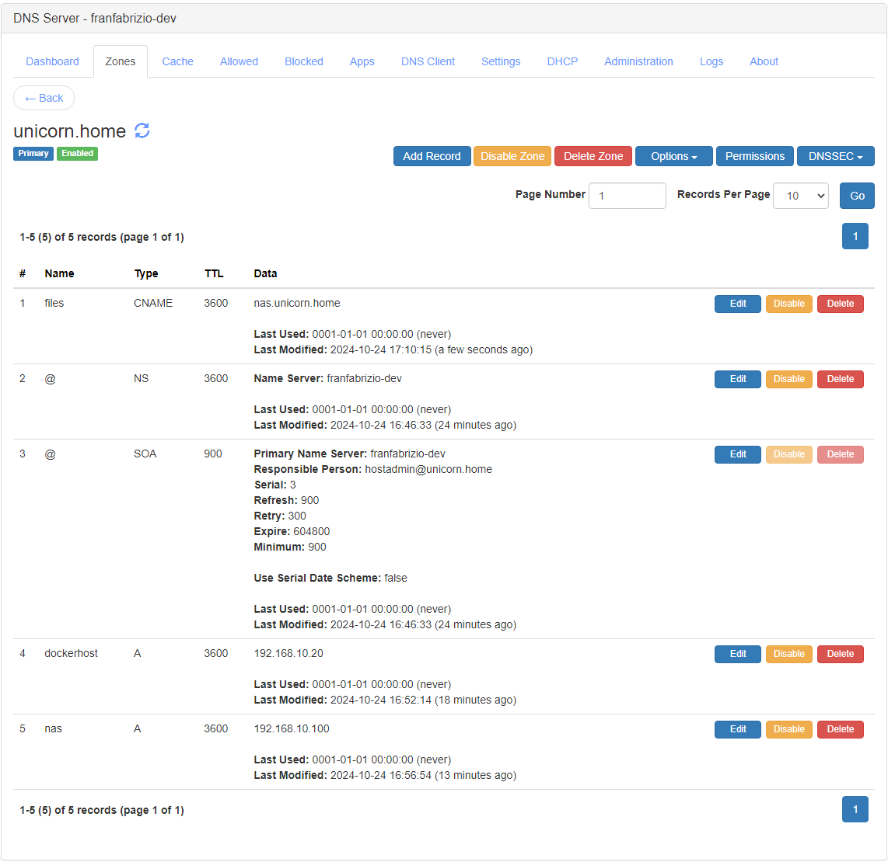

That's all there is to setting up your private DNS domain's zones. Now any client which uses this DNS server as its nameserver will be able to resolve names like `dockerhost.unicorn.home` to their IP addresses. And, since Technitium is also a full-fledged DNS resolver, it'll figure out the address of any other domain name you ask about as well. Note that we didn't have to configure any upstream DNS nameservers, unlike with a DNS forwarder where you need to tell it to forward to a specific nameserver like 1.1.1.1 (Cloudflare) or 8.8.8.8 (Google). Pretty neat, eh?

## Setting up Technitium for DHCP

We'd like DHCP to provide three functions for us:

1. Making sure that hosts get the IP addresses we've assigned to them in our DNS zone. Yes you can do this manually on each host, but having it centrally managed in DHCP is more convenient and easier to change in the future.
2. Making sure that all of our network devices use our new DNS server as their nameserver. Similarly, we can do this on each device but managing it via DHCP is far more convenient.
3. Updating our DNS records as devices come and go from the network.

There are many ways to provide DHCP service on your network. You can use your router's built-in DHCP service. Alternately, I've run isc-dhcp-server instances in the past to complement the old school bind9 approach, and it does work, but it takes a fair amount of finnicky configuration and upkeep. (If you're interested, Ars Technica's Lee Hutchinson [did a nice writeup](https://arstechnica.com/information-technology/2024/02/doing-dns-and-dhcp-for-your-lan-the-old-way-the-way-that-works/#page-4) of this recently.) The main reason I adopted Technitium for DHCP is that it integrates DHCP with DNS right out of the box, ensuring that the two stay in sync and that your private domain records are always up to date, and provides a nice web UI to manage it all, allowing me to retire both bind9 and isc-dhcp-server (along with pi-hole since Technitium also supports ad-blocking).

### Step 1: Disable Other DHCP Servers

Nothing is more frustrating than trying to debug why your DHCP server isn't working only to discover that another DHCP server was responding. Disable any other DHCP servers before you start, like those built into routers.

### Step 2: Set up a Techitium DHCP Scope

Head over to the DHCP tab, then click on Scopes. You can see by default that Technitium creates a scope for the 192.168.1.0 subnet. Unless that's what you're using for your internal address range, feel free to delete this scope. Or not, it won't harm anything to leave it.

We'll create a scope for our 192.168.10.0 subnet. Click Add Scope, and you'll see a long form for defining a new scope.

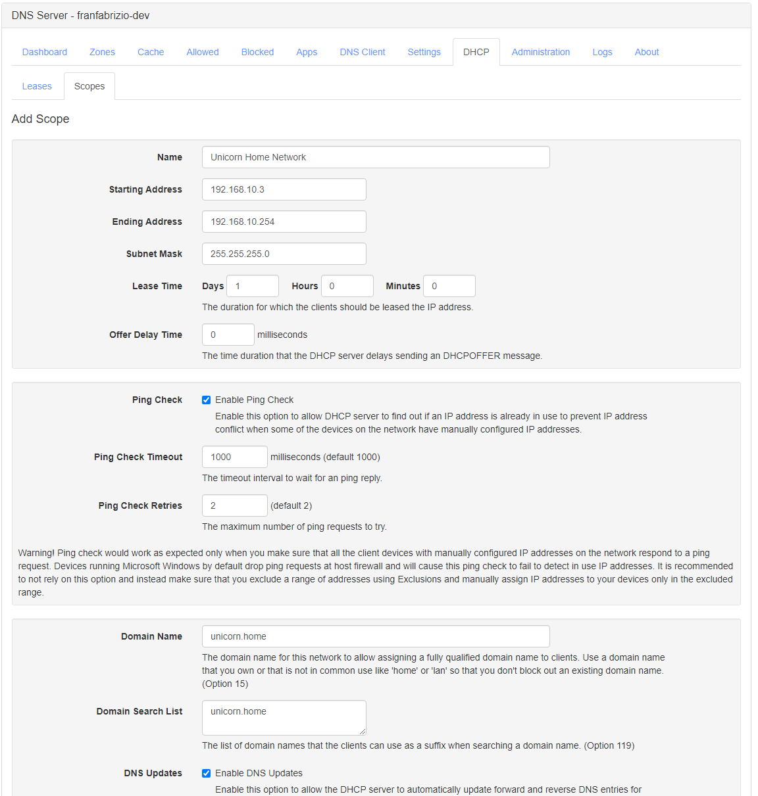

We get starting by giving our scope a name, and then defining the range of IPs we'd like the DHCP server to lease out. Here we're using 192.168.10.3-254 (remembering that .1 is the router and .2 is this DNS/DHCP server). The next default I change is to enable the Ping Check, that's just a nice additional safeguard to avoid introducing IP conflicts to your network.

Since we're using `unicorn.home` as our domain, we can specify that as the Domain Name, and also as the Domain Search List, which will be given to the clients so they know which domains to search if they have just a short name e.g. `dockerhost`.

Finally, I enable the DNS Updates checkbox so that DHCP will update my DNS records as clients come on and off the network.

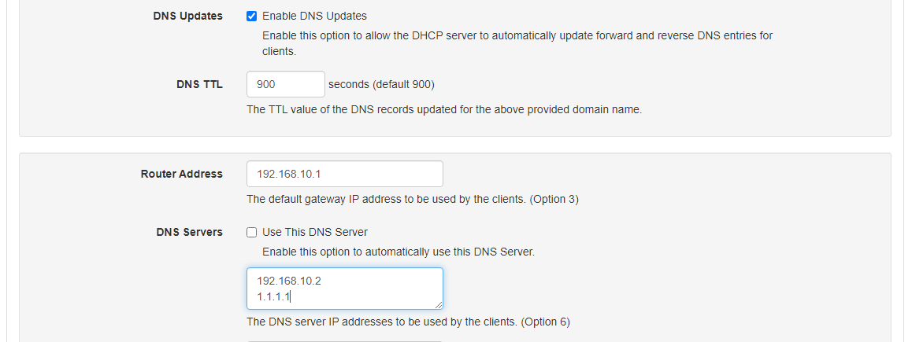

Continuing on, we specify the router so that our clients will know how to route non-local network traffic, and we specify the DNS servers. You can leave the default Use This DNS Server checked, but I like to give it a backup, so I uncheck that, specify the IP address of this DNS server as the primary, and then a public one like Cloudflare's 1.1.1.1 as the secondary. This just gives clients a backup if our DNS server is down.

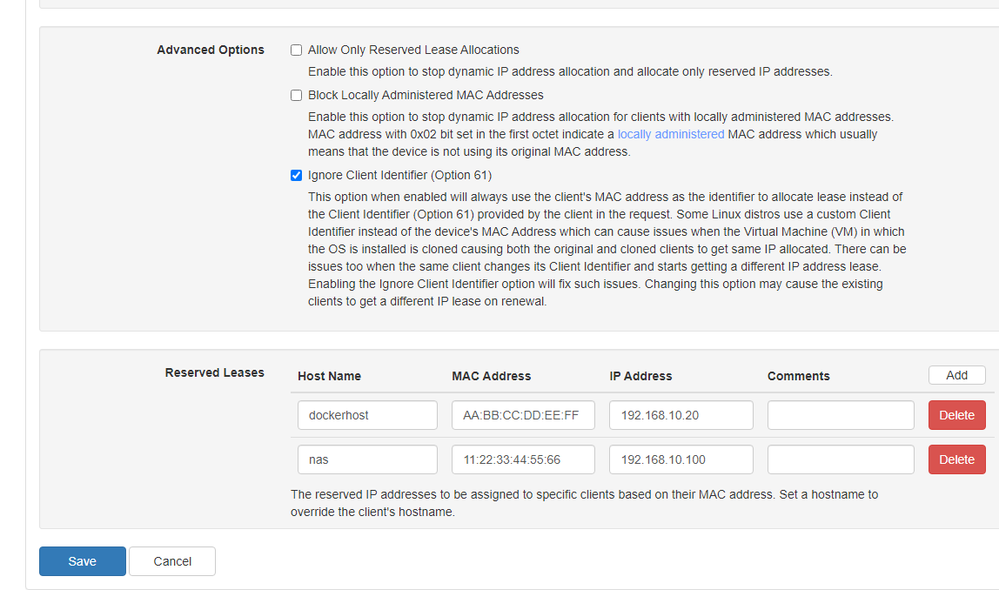

The last section is where you can define reserved leases. It is important to define a reserved lease for any machine you entered as an A record in the DNS zone, so here we'll define reserved leases for `dockerhost` and `nas`. This means they'll get the same IP address every time, and their IP address won't ever be used for another machine.

Click Save. You should see your new scope in the scope list.

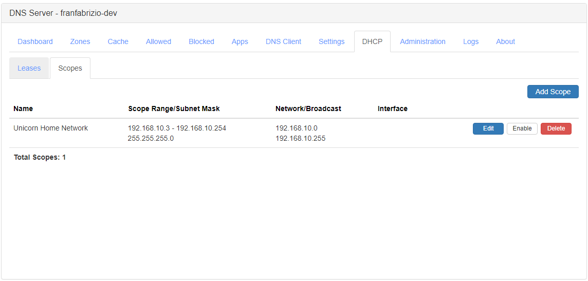

Once you create the scope, it _should_ be enabled automatically. Fun discovery: it's not enabled in my screenshot because I was grabbing these from a test Technitium instance I was running as a portable app on my home PC that is itself managed by a different DHCP server. Technitium detected this and helpfully refused to start its own DHCP server to avoid multiple DHCP servers on the network. In your instance, assuming you have disabled other DHCP servers as suggested in Step 1 above, that Enable button should be replaced with a Disable button, indicating that it is currently enabled.

### Step 3: Test your DHCP Clients

Now you can go to any DHCP client on your network and release and renew its DHCP lease, and it should pick up a lease from our new DHCP server. You can confirm this on the DHCP -> Leases tab of the Technitium interface. Here's what the Leases tab on my own production instance looks like:

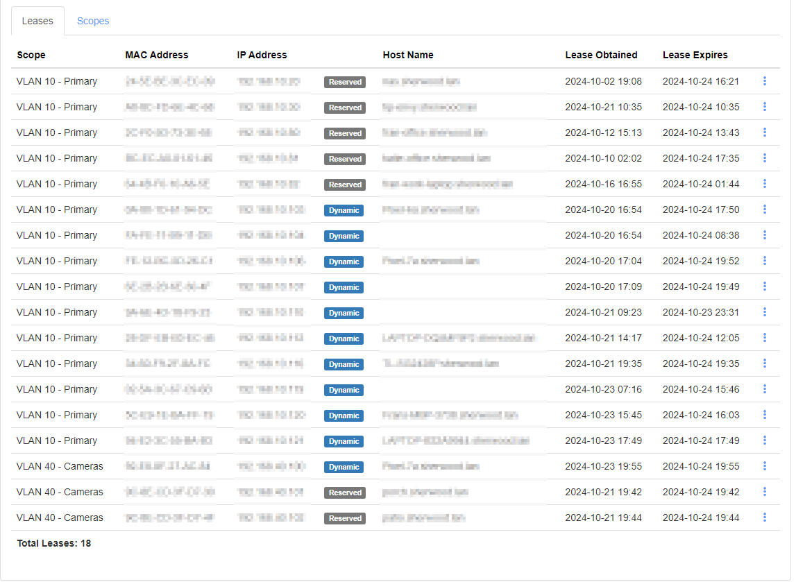

As you can see, my server has assigned a mix of 18 reserved and dynamic leases across my two scopes.

Even cooler, when a new client receives a DHCP lease, they also receive DNS entries! For a real example, here's the record that Technitium created in DNS when my phone joined my home network.

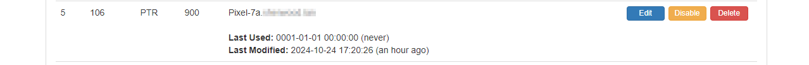

I didn't have to define this anywhere - the DHCP server just updated the DNS zone automatically when it assigned the lease to my phone. The `Pixel-7a` is the name that my phone self-reports to the network when it broadcasts out its DHCP request (DHCP Option 12 if you really want to geek out). So now you can even use friendly names to reach devices which don't have a reserved IP defined in DNS or DHCP! You could in theory do this for all of the devices on your network, but for things that are permanently on my network and which are providing services to other hosts, I prefer to make sure their IP address stays consistent, so I define DNS records and DHCP reserved leases for all servers at a minimum, as well as any other devices which need to be found by IP address, for example my security cameras are added to the recording software via IP, not name.

At this point, you're good to go! We've got private DNS for `unicorn.home`, we've defined our hosts in our DNS zone, and our DHCP server is making sure all of the clients point to the right nameserver and that DNS knows about everyone on the network. Enjoy the use of friendly domain names on your home network!

## [OPTIONAL] Setting up Technitium for Ad-Blocking

One of the nice things about running your own Technitium instance is that it also gives you ad blocking in addition to DNS and DHCP service. Setting that up is beyond the scope of this tutorial, but it is a straightforward process which you can follow [here on Technitium's Blog](https://blog.technitium.com/2018/10/blocking-internet-ads-using-dns-sinkhole.html#:~:text=To%20enable%20Ad%20blocking%2C%20you,click%20and%20add%20those%20URLs.).

