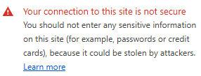
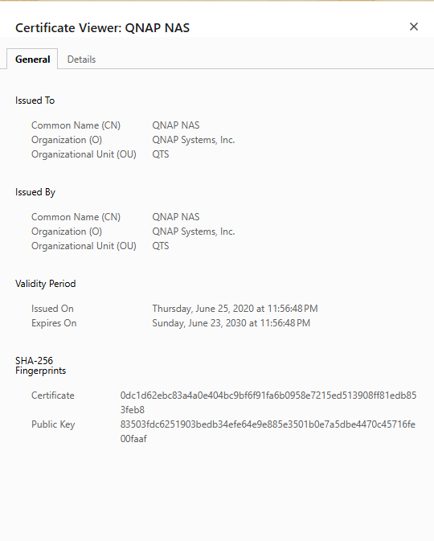
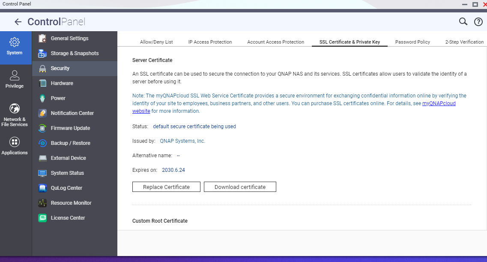
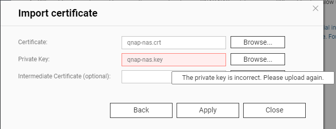
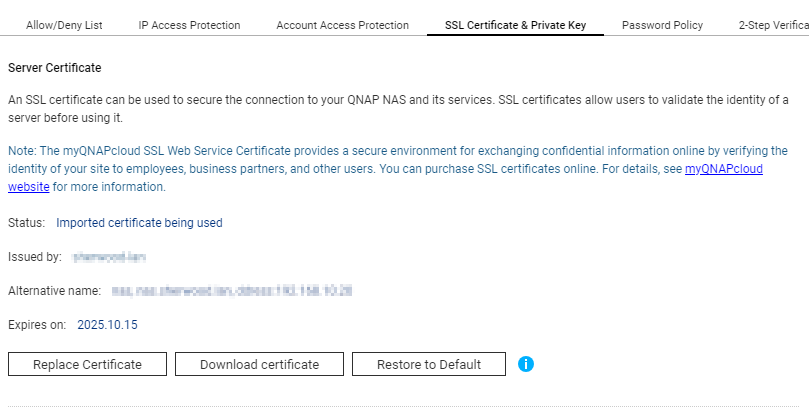

I've recently set up my own private certificate authority to issue keys for my private homelab domain, and I was ready to get rid of the browser warnings that come along with QNAP's default cert:



The warning is due to QNAP shipping QTS with a self-signed certificate.



QNAP does allow you to replace this default cert with your own. You can find the menu to do so at Control Panel -> Security -> SSL Certificate & Private Key



I generated a new key and certificate and clicked Replace Certificate here. This takes you to a screen where you can upload the certificate and key.



Unfortunately, as soon as I browsed to the new key, the box turned red and I got an error message "The private key is incorrect. Please upload again." Rude!

My internet searches were unusually fruitless on this error message. There were a few dead ends, but nothing that clearly pointed out the root cause: **QNAP QTS requires / only accepts RSA keys**[^1] (and apparently no longer than 2048 bits, though I haven't tested this). My step-ca certificate authority is based on an ECDSA chain.

```
$ openssl x509 -noout -text -in qnap-nas.crt
Certificate:
    Data:
        Version: 3 (0x2)
        Serial Number:
            XXXXXX
        Signature Algorithm: ecdsa-with-SHA256
```

That's the cause of the failure, but neither the QNAP interface nor the QNAP docs will make this apparent.

It's not easy to get step-ca to generate RSA keys (requires a second instance) but I also have an XCA certificate authority, which makes RSA key and cert generation very straightforward. I generated a new set.

```
$ openssl x509 -noout -text -in qnap-nas-rsa.crt
Certificate:
    Data:
        Version: 3 (0x2)
        Serial Number: XXXXXXX
        Signature Algorithm: sha256WithRSAEncryption
```

Back to QNAP to upload them. No error this time!



Problem solved.

[^1]: It's technically just the web interface which doesn't support this. It appears you can bypass the web interface and use an ECDSA key and certificate by following the procedure outlined in this forum post: [https://forum.qnap.com/viewtopic.php?t=110557]()

