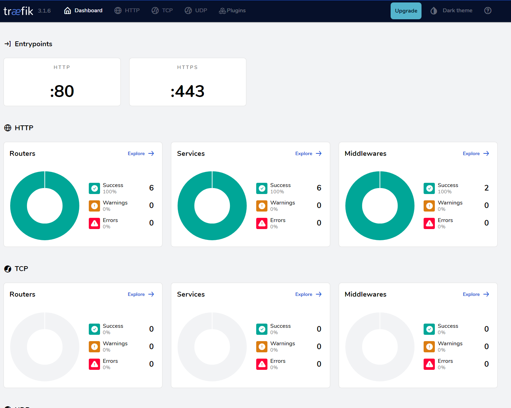

## Introduction

In this post we'll be setting up a Traefik service in our Docker environment. Traefik is a reverse proxy/load balancer/edge router designed for cloud-native environments. This is useful for a lot of reasons such as performance and security, but one of the most common reasons to do this in your homelab is so that you don't have to expose a bunch of non-standard ports to reach your containerized web services. With Traefik, all of them can respond on port 80, and Traefik will route to the appropriate one based on the domain name in the URL.

Traefik has a massive amount of functionality, but here we're just going to get basic application routing. In a future post, I'll cover secure connections with SSL. It can do far more than that, though, and I encourage folks to spend some quality time with the Traefik documentation.

## How Traefik Works with Docker

Traefik itself also runs as a container in your Docker environment, and it does an automatic discovery process to find other containers in the Docker environment. When it finds a container it sets up routing rules for it, either automatically for all containers or on a container-by-container basis, based on how you've configured Traefik. You use Docker labels on the individual containers to configure the setup of each service in Traefik.

## Understanding Traefik Configuration

Traefik has an interesting split configuration model.

1. _**Static Configuration**_ is evaluated at startup time and is defined in one of the following three **mutually-exclusive** places, in this order of precedence:
   1. A configuration file (we'll use this option via the `traefik.yml` file we will create in a moment)
   2. Command-line arguments
   3. Environment variables

   Static configuration is used to define the **entryPoints** (effectively, the ports Traefik should listen to) and the providers that provide the dynamic configuration, discussed next.

2. _**Dynamic Configuration**_ is evaluated on an ongoing basis while running, and is retrieved from **providers**. A provider is some infrastructure component that has information about the services that Traefik needs to route. A provider is often some sort of container orchestrator like Kubernetes, AWS ECS or Docker, but can also be a key-value store or even just a file. Today, we'll be using Docker as a provider. This configuration is dynamic - as it changes, Traefik will detect and respond to those changes in near real-time.

## Setting Up Traefik for Docker

We're going to do things in this order:
1. Create our static configuration.
2. Install and start Traefik.
3. Explain and demonstrate dynamic configuration.

### Step 1: Create Our Static Configuration

I've already hinted about our strategy for static configuration - we'll be using a configuration file. Create a `traefik.yml` file in the current directory on your host, and add this YAML to it for a basic Traefik setup on a single Docker host:

```yaml
global:
  checkNewVersion: true
  sendAnonymousUsage: false

entryPoints:
  http:
    address: ":80"

api:
  dashboard: true
  insecure: true

accessLog: {}

log:
  level: DEBUG

providers:
  docker:
    endpoint: "unix:///var/run/docker.sock"
    exposedByDefault: false
```

Let's go through this line-by-line.

* The **global** section tells Traefik to check for new versions (you'll get that Upgrade button on your dashboard like in the screenshot below). I also choose to turn off sending anonymous usage stats to Traefik.
* The **entryPoints** section tells Traefik to listen for HTTP protocol on port 80. Later we will publish port 80 to the docker host so Traefik can receive requests.
* The **api** section turns on the Dashboard (port 8080 by default) and allows HTTP (insecure) access to it.
* The **accessLog** section turns on access logging. Now every request that Traefik routes will be logged. By default, this will go to STDOUT so you can view it using docker's log display for the container log. You can see the Traefik documentation for other options if you want a persistent access log. Here's an example log entry from me accessing my Paperless-NGX container's login page:
`192.168.10.8 - - [02/Nov/2024:15:12:56 +0000] "GET /accounts/login/?next=/ HTTP/2.0" 200 3164 "-" "-" 96 "https-webserver@docker" "http://172.18.0.3:8000" 68ms`
* The **log** section is for Traefik's own log (not access logging). Here I set the log level to DEBUG for more information. Again these go to STDOUT by default so you can view the information in the docker log for the container.
* Finally, the **providers** section is where we tell Traefik where to get its dynamic configuration information. Here we set up a Docker provider and use `endpoint` to point Traefik to the Docker API via a file socket. The `exposedByDefault: false` turns off Traefik's default behavior of automatically routing to any container it finds. This deserves some additional explanation which we'll discuss shortly.

Now that we've created our `traefik.yml` file with our static configuration, we're ready to install and start Traefik.

### Step 2: Installing and Starting Traefik

We will install Traefik using the [official Traefik Docker images](https://hub.docker.com/_/traefik).

You need to publish at least two ports out of the Traefik container and onto the host, port 80 which is where all of the application traffic will come in for Traefik to route, and port 8080 which is Traefik's own dashboard. You'll also need to attach the container to the persistent configuration file we just created and bind it to the container's `/etc/traefik/traefik.yml` file.

You can do this with plain Docker or docker compose or a Docker manager like Portainer. Here's the plain Docker command:

```sh
docker run -d -p 80:80 -p 8080:8080 -v $PWD/traefik.yml:/etc/traefik/traefik.yml traefik:v3.2
```

Here's a docker-compose.yml to do the same thing:

```yaml
services:
  traefik:
    image: "traefik:v3.2"
    container_name: "traefik"
    command:
      # lower this to something like ERROR once you're sure it's working
      - "--log.level=DEBUG"
      - "--api.insecure=true"
      - "--providers.docker=true"
      - "--providers.docker.exposedbydefault=false"
      - "--entryPoints.web.address=:80"
      # consider turning this off after you are sure it is working, it can be noisy
      - "--accesslog=true"
    ports:
      - "80:80"
      - "8080:8080"
    volumes:
      - "/var/run/docker.sock:/var/run/docker.sock:ro"
```

However you like to start containers, once you get the Traefik instance up and running verify that you can reach your Traefik Dashboard on port 8080 (`http://<YOUR-DOCKER-HOST>:8080/dashboard/`). It will look similar to this:



### Step 3: Explaining and Demonstrating Dynamic Configuration

Traefik's dynamic configuration depends upon which provider(s) you're integrating with and how automated you want the discovery and configuration process to be. When using Docker as a provider, Traefik will listen to the Docker API (generally via a file socket like we configured above, though there are also options for SSH, HTTP, and TCP access to the Docker daemon) for containers to come and go. When they come online it will examine their labels and set up whatever routing is necessary, and it will tear down routing as containers go offline.

#### Traefik's Automatic Docker Routing

When Traefik discovers a new Docker container in its environment, by default it will try to automatically route to the lowest numbered port that container has exposed (this is different than publishing a port to the host - all containers have ports their services use and respond to internally), and it will use the name you've given that service to route requests to it. So if you startup a new Docker container called `helloworld` on your docker host named `dockerhost.local`, Traefik will inspect it, find that you've got a service on say port 8000, and will now route any request for `http://helloworld.dockerhost.local` to that container's port 8000 automatically without you having to put a port in the URL or any Traefik labels whatsoever on the container! You can either simply drop an entry for `helloworld.dockerhost.local` in your DNS to route to the docker host's IP, or to demonstrate this without DNS, you can even just add a Host header, like this:

`curl -H Host:helloworld.dockerhost.local http://MY-DOCKERHOST-IP/`

That's a really cool, magical convenience, but it also makes Traefik feel very much like a mysterious black box. For beginners, I recommend turning off that behavior with `exposedByDefault: false` in the static configuration as we did above. That way, no container will be automatically routed, and a container will need at least a `traefik.enable=true` label to be routed by Traefik, and you'll be "forced" to learn more about the various ways to configure Traefik routing. Once you get more comfortable with Traefik, you can turn automatic routing back on and enjoy the convenience without being baffled as to what's happening.

#### Setting Up an Example Service for Traefik to Route

To illustrate dynamic configuration, we first need a service we want to run and route to from Traefik. Traefik provides a nice demo service called `whoami`, a [tiny containerized Go server](https://github.com/traefik/whoami) which prints out some OS info and echoes the HTTP request that it receives.

Here's a docker-compose.yml for the `whoami` service:

```yaml
services:
  whoami:
    image: traefik/whoami
    command:
       # It tells whoami to start listening on 2001 instead of its default 80
       - --port=2001
       - --name=iamfoo
    ports:
      - "2001:2001"
```

Here we're publishing the service onto the host's port 2001. Traefik's not involved yet (don't be fooled by traefik in the image name, that's Traefik the company which made this service, not their proxy of the same name).

Ok, let's get this container up and running:

```
$ docker compose up
[+] Running 4/4
 ✔ whoami Pulled                                                                                                   1.3s
   ✔ a5d67c72e18d Download complete                                                                                0.1s
   ✔ 733db08f86a6 Download complete                                                                                0.2s
   ✔ 0b8c4591162f Download complete                                                                                0.2s
[+] Running 2/2
 ✔ Network whoami_default     Created                                                                              0.0s
 ✔ Container whoami-whoami-1  Created                                                                              0.1s
Attaching to whoami-1
whoami-1  | 2024/11/03 04:48:59 Starting up on port 2001
```

Let's verify that the container is up and running, which I do by using curl to hit port 2001 on my docker host with HTTP and seeing that `whoami` returns information about itself:

```
$ curl http://<YOUR-DOCKER-HOST>:2001/
Name: iamfoo
Hostname: a3acbacaaac7
IP: 127.0.0.1
IP: ::1
IP: 172.18.0.2
RemoteAddr: 172.18.0.1:60996
GET / HTTP/1.1
Host: localhost:2001
User-Agent: curl/7.81.0
Accept: */*
```

We can see the OS and request info that gets returned, so we've verified that our service is running.

This is great, but it's awkward to have to use the name or IP address of our docker host and also remember that it's published on port 2001, and if we have lots of services, we now have lots of ports published and open on our docker host, which is definitely not optimal.

At this point, you should have two containers running. A `docker ps` should look something like:

```sh
$ docker ps
CONTAINER ID   IMAGE            COMMAND                  CREATED          STATUS          PORTS                                        NAMES
fc5290468c2c   traefik:v3.2     "/entrypoint.sh --lo…"   37 minutes ago   Up 37 minutes   0.0.0.0:80->80/tcp, 0.0.0.0:8080->8080/tcp   traefik
5de6542b4436   traefik/whoami   "/whoami --name=iamf…"   37 minutes ago   Up 37 minutes   2001/tcp                                     whoami-whoami-1
```

#### Putting Our Service Behind Traefik

Let's now put `whoami` behind our `traefik` proxy.

Modify `whoami`'s docker-compose.yml and alter the entry for `whoami` to add the Traefik label as shown below.

Also remove the port 2001 publishing info from `whoami` since it no longer needs to respond on that port on the host directly, so we no longer need to publish any ports. This also means we no longer need to choose a non-standard port, and can just let the `whoami` service use its default port 80 internally.

```yaml
services:
  whoami:
    image: traefik/whoami
    command:
       - --name=iamfoo
    labels:
      - "traefik.enable=true"
      - "traefik.http.routers.whoami.rule=Host(`whoami.dockerhost.local`)"
      - "traefik.http.routers.whoami.entrypoints=web"
```

The three new labels turn Traefik routing on for this container, give Traefik a Host rule with a service name so it knows when to route to this container, and tells Traefik to allow traffic to this container via the web entrypoint we configured earlier (which is port 80 on the host which Traefik published).

Restart your `whoami` container. Now you should have two containers running, like this:

```sh
$ docker ps
CONTAINER ID   IMAGE            COMMAND                  CREATED          STATUS          PORTS                                        NAMES
fc5290468c2c   traefik:v3.2     "/entrypoint.sh --lo…"   37 minutes ago   Up 37 minutes   0.0.0.0:80->80/tcp, 0.0.0.0:8080->8080/tcp   traefik
5de6542b4436   traefik/whoami   "/whoami --name=iamf…"   37 minutes ago   Up 37 minutes   80/tcp                                       whoami-whoami-1
```

Notice that `whoami` is now back to its default port 80 and `traefik` itself is also on port 80. This is fine however, because only `traefik` published port 80 to the host (as evidenced by the `0.0.0.0:80->80/tcp` listing in the PORTS column).

Let's try to use `curl` again to reach `whomai`, this time routing through `traefik`:

```
(nhgis-ingest) fran@HOME-OFFICE-2020:~/sandbox/whoami$ curl -H Host:whoami.dockerhost.local http://<YOUR-DOCKER-HOST>/
Name: iamfoo
Hostname: 5de6542b4436
IP: 127.0.0.1
IP: ::1
IP: 172.18.0.2
RemoteAddr: 172.18.0.3:53544
GET / HTTP/1.1
Host: whoami.dockerhost.local
User-Agent: curl/7.81.0
Accept: */*
Accept-Encoding: gzip
X-Forwarded-For: 172.18.0.1
X-Forwarded-Host: whoami.dockerhost.local
X-Forwarded-Port: 80
X-Forwarded-Proto: http
X-Forwarded-Server: fc5290468c2c
X-Real-Ip: 172.18.0.1
```

Notice that the response is different and longer this time. It is echoing back some extra headers it received, which were attached by Traefik! Our request went to `http://<YOUR-DOCKER-HOST>/` - no more port 2001.

We also had to add the Host header `Host:whoami.dockerhost.local` -- which is the hostname we specified in the traefik labels on the `whoami` service -- so that Traefik would know which service the request was for. This was a workaround for the demo, but for a more realistic example we'd put `whoami.dockerhost.local` into DNS so we could just request `http://whoami.dockerhost.local/`. If this were my actual home domain I would do just that, but since `dockerhost.local` is just an example name for this blog post, I will do the next best thing and "fake" DNS by adding an entry in my `/etc/hosts` file instead and have it function the same way.

```text
# This is on whatever machine you're making the request from
IP.ADDRESS.OF.DOCKERHOST  whoami.dockerhost.local
```

With that in place, I can now use the URL `http://whoami.dockerhost.local/` and reach my service via Traefik:

```
$ curl http://whoami.dockerhost.local/
Name: iamfoo
Hostname: 5de6542b4436
IP: 127.0.0.1
IP: ::1
IP: 172.18.0.2
RemoteAddr: 172.18.0.3:52750
GET / HTTP/1.1
Host: whoami.dockerhost.local
User-Agent: curl/7.81.0
Accept: */*
Accept-Encoding: gzip
X-Forwarded-For: 172.18.0.1
X-Forwarded-Host: whoami.dockerhost.local
X-Forwarded-Port: 80
X-Forwarded-Proto: http
X-Forwarded-Server: fc5290468c2c
X-Real-Ip: 172.18.0.1
```

With DEBUG logging and the access log both turned on, we can also see in Traefik's logs how this request was handled:

```
2024-11-03 22:45:47 2024-11-04T04:45:47Z DBG github.com/traefik/traefik/v3/pkg/server/service/loadbalancer/wrr/wrr.go:196 > Service selected by WRR: b9597fe0f5ca1856
2024-11-03 22:45:47 172.18.0.1 - - [04/Nov/2024:04:45:47 +0000] "GET / HTTP/1.1" 200 388 "-" "-" 4 "whoami@docker" "http://172.18.0.2:80" 10ms
``` 

We see a note that the "b9597fe0f5ca1856" container was selected for the request to be routed to, and then we see Traefik forwarding the call to that request, and getting a 200 response code back.

We've done it! We've put a simple service behind Traefik and routed to it using HTTP and a friendly-name URL! The real usefulness comes when we have many services running. They can all respond to friendly names via port 80, and Traefik will route appropriately. This makes for a more polished homelab experience and sets the stage to do even cooler things with Traefik!


